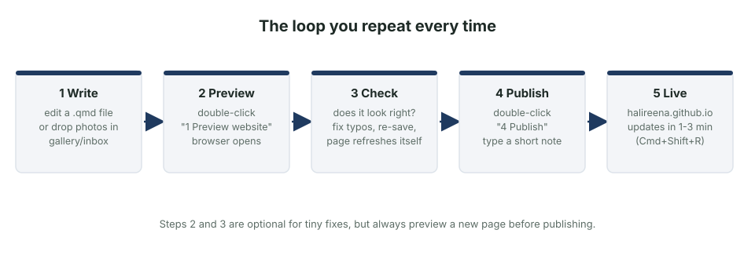
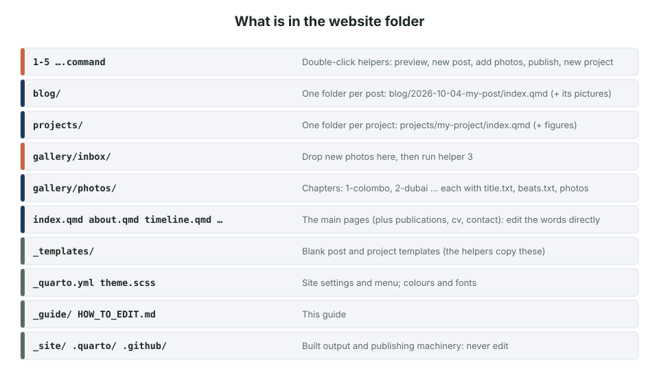
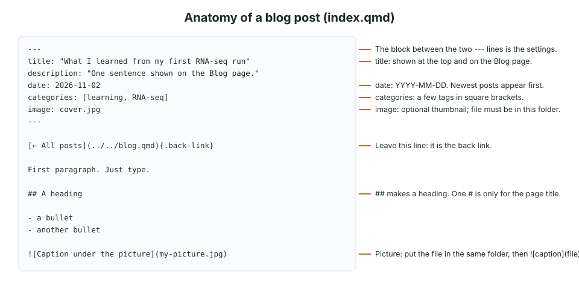
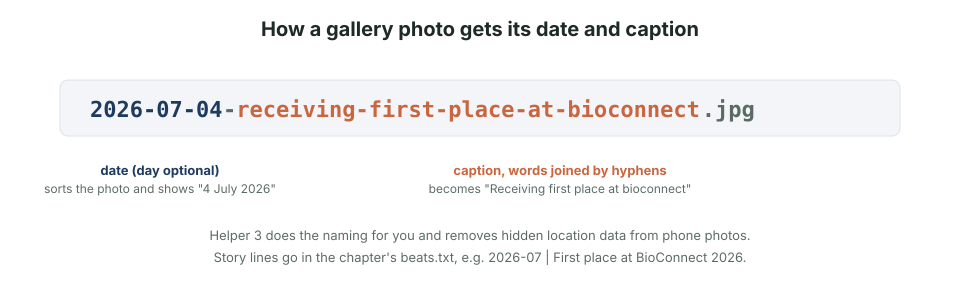

Your website is a folder of plain text files. You edit a file, look at the result, and press publish. That is the whole job. This guide shows the handful of things you will do again and again, with pictures.

**The folder:** `Desktop › 05 Life & Planning › get my life together › halireena.github.io`
**The live site:** https://halireena.github.io



## The five helpers

At the top of the folder are five files you double-click. They open a small Terminal window, do the job, and tell you what happened. You never need to type commands.

| Helper | What it does |
|---|---|
| **1 Preview website** | Opens the site in your browser from your computer. Keep the window open while you edit: every time you save, the page refreshes. Press `Ctrl + C` in the window to stop. |
| **2 New blog post** | Asks for a title, creates the post folder with today's date, and shows it in Finder. |
| **3 Add gallery photos** | Takes photos from `gallery/inbox`, removes hidden location data, shrinks them, asks you for a date and caption for each, and rebuilds the Gallery page. |
| **4 Publish** | Checks the site builds, asks for a one-line note, uploads, and GitHub puts it live in 1–3 minutes. |
| **5 New project page** | Like helper 2, but for a project. |

The first time, macOS may say the file "cannot be opened because it is from an unidentified developer". Right-click the file → **Open** → **Open**. After that it works with a double-click.



## Write a blog post

1. Double-click **2 New blog post** and type a title. A folder like `blog/2026-11-02-my-title/` appears with an `index.qmd` inside.
2. Open `index.qmd` in a text editor (TextEdit works: right-click → Open With → TextEdit. VS Code or Positron are nicer).
3. Write. The picture below shows what each line does.
4. Double-click **1 Preview website**, click **Blog**, read your post.
5. Double-click **4 Publish**.



**Formatting you will use:**

| You type | You get |
|---|---|
| `## Heading` | a section heading |
| `**bold**` `*italic*` | **bold** *italic* |
| `[words](https://…)` | a link |
| `- item` | a bullet point |
| `1. item` | a numbered step |
| `> text` | a quote |
| `` | a picture with a caption |

**A post that is not ready:** add `draft: true` to the settings block and it stays invisible until you remove the line.

**Linking to the site's own pages:** `[my thesis](../../projects/potato-late-blight/)` from a post; `[the gallery](gallery/index.qmd)` from a top-level page.

## Add pictures

### To the Gallery

1. Drop the photos into `gallery/inbox/`.
2. Double-click **3 Add gallery photos**. It asks which chapter (Colombo, Dubai, or a new one), then for each photo a **date** (it suggests one from the photo) and a **caption** in plain words.
3. Preview, then publish.



The short story lines between photos live in each chapter's `beats.txt`, one per month:

```
2026-07 | First place at BioConnect 2026.
2026-09-18 | Thesis presented.
```

Add a line for a new month and run helper 3 again (or, in Terminal inside the folder, `python3 gallery/make_gallery.py`).

**Only publish photos you are allowed to.** Ask people who appear in them. Never upload a photo that shows a student ID, a badge QR code or a document with personal details.

### To a post or project

Copy the picture into the post's or project's folder and write `` where you want it. Keep pictures under about 1 MB (export at about 1600 px wide). To make one smaller on the page: `{width=60%}`.

### Your profile photo

Replace `images/me.jpg` with a square photo of the same name. The link-preview card is `images/share-card.jpg`; make a new one if you change the photo.

## Add a project

1. Double-click **5 New project page** and type a title. The folder appears under `projects/`.
2. Fill in each section of `index.qmd`: question, data, methods, results, limitations, what you learned, code link. The number tiles at the top are optional: delete that block if you have no numbers.
3. Put your figures in the same folder and set `image:` in the settings block to the one you want as the thumbnail.
4. Preview, then publish. Projects are listed newest first by `date`.

## Change the words on a page

| Page | File |
|---|---|
| Home | `index.qmd` (written in HTML: change the words between `>` and `<`, leave the tags) |
| About | `about.qmd` |
| Timeline | `timeline.qmd` (copy an existing entry block and edit the date, place, tags and text) |
| Publications | `publications.qmd` |
| CV | `cv.qmd` |
| Contact | `contact.qmd` |
| Menu and site title | `_quarto.yml` |
| Colours and fonts | `theme.scss` (the colour codes at the top) |

Every page starts with a block between two `---` lines. Keep the structure, change the words. If a page stops building, the mistake is almost always in that block: a missing quote mark or a changed indent.

## Publish

Double-click **4 Publish**. If it says the site did not build, read the last lines in the window: they name the file and the line. Fix it, save, run it again.

After it says "Uploaded", GitHub needs 1–3 minutes. If the live site looks old, press **Cmd + Shift + R**. If GitHub itself is slow (it happens), the Actions tab of your repository shows the job as *queued*; it will go through on its own.

## Things to know

- **The contact form** is connected to Formspree (form ID `mljgddvo`, account under your Gmail). Messages arrive in your inbox; the free plan allows 50 a month. If you ever make a new form, change the ID on the line `const FORMSPREE_ID = "…";` in `contact.qmd`.
- **The CV download** on the site is `cv/Halireena_Rushdiha_CV.pdf`, a copy without your phone number. It is regenerated every time you run the CV build script (`Desktop › 04 Career › CV 2026 › _build (scripts, ignore) › build_cv_send.py`); after that, run helper 4 to publish it.

## If something goes wrong

- **Preview shows an error page:** read the message; it names the file. Usually a typo in the `---` block.
- **A picture does not show:** the file name in the text must match the file exactly, including `.jpg` vs `.jpeg` and capital letters.
- **Publish says "Nothing new to publish":** you have not saved any changes since the last publish.
- **You want to undo everything since the last publish:** in Terminal, inside the folder, run `git checkout -- .` (this discards your unsaved edits).
- **Something is broken and you cannot see why:** open a Claude Code session in this folder and describe the problem. The whole site, this guide and the helpers are in the folder, so any session can pick it up.

## Where everything is

- Your master CV and the script that builds it: `Desktop › 04 Career › CV 2026`
- This guide: `HOW_TO_EDIT.md` in the site folder, and the illustrated version `_guide/HOW_TO_EDIT.html`
- The templates the helpers copy: `_templates/`
- The published site's code: https://github.com/halireena/halireena.github.io
