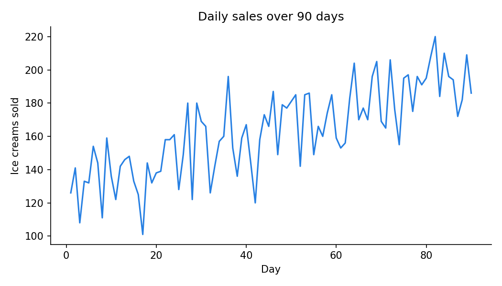

[← All projects](../../projects.qmd){.back-link}

::: {.question-box}
One sentence: the question this project answers.
:::

::: {.stats}
::: {.stat}
[90]{.num}
[days of data]{.lbl}
:::
::: {.stat}
[6.4]{.num}
[extra sales per °C]{.lbl}
:::
::: {.stat}
[2]{.num}
[figures]{.lbl}
:::
::: {.stat}
[1]{.num}
[script]{.lbl}
:::
:::

## The question

What were you trying to find out, and why does it matter? Two or three sentences.

## The data

- **Source:** where the data came from (with a link if public).
- **Size:** how many rows, samples or images.
- **Columns or variables:** what each one means.

## Methods

1. What you did first.
2. What you did next.
3. How you checked the result.

## Results

{fig-alt="Describe the figure for screen readers"}

{fig-alt="Describe the figure"}

- The main finding, with a number.
- A second finding.

## Limitations and next steps

- What the data or method could not tell you.
- What you would do next.

## What I learned

- One honest, specific lesson.
- Another.

## Code

[View the repository on GitHub](https://github.com/halireena){.btn-cute .solid}
