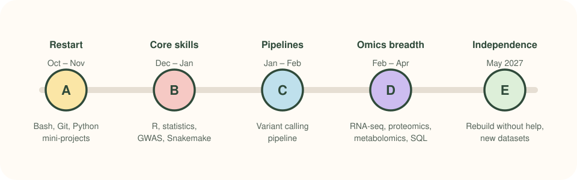

[← All posts](../../blog.qmd){.back-link}

My MSc taught me to run established bioinformatics tools well, from Galaxy and BLAST to limma
and DESeq2. The next step is being able to **write every analysis from scratch** and adapt it to
new problems. So I've made a plan for exactly that.

{fig-alt="Timeline of five learning phases from October 2026 to May 2027"}

## The rules I'm following

1. **Small wins.** Every task fits in 60–90 minutes.
2. **I type every line.** Hints first, answers only when I'm really stuck.
3. **Everything goes on GitHub**, so progress is visible, even the messy bits.
4. **One blog post a week** about what I built or learned.

## What's first

Three small Python projects about biology: a sequence toolkit, a FASTA stats tool and a plotter
for plant trait data. Each one gets tests, a README and a page here when it's done.

## Why share it?

Because learning in public keeps me honest, and maybe it helps someone else who's in the same
spot. If you're learning too, say hi! 
