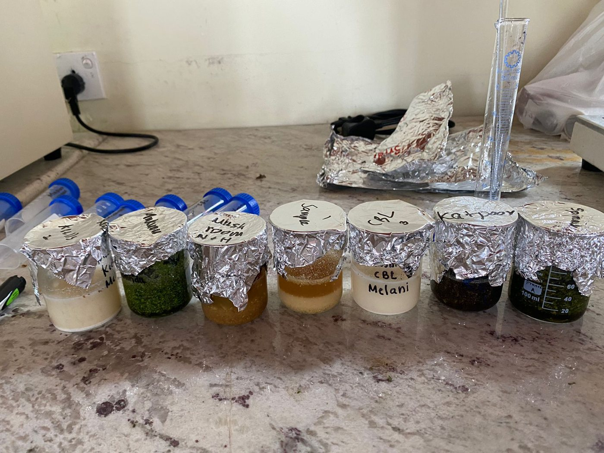
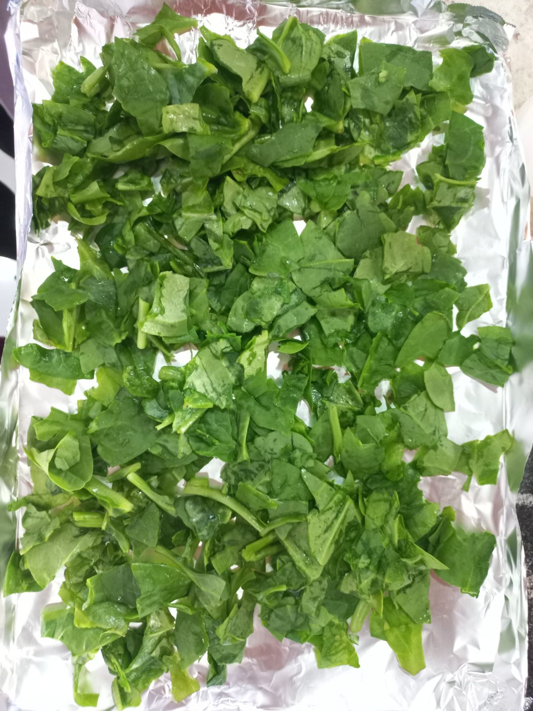
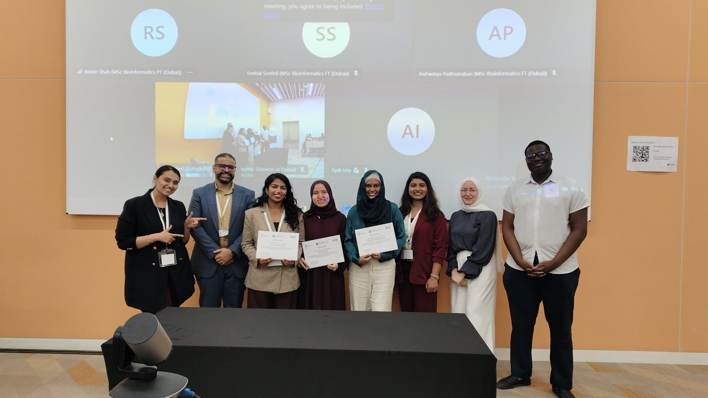
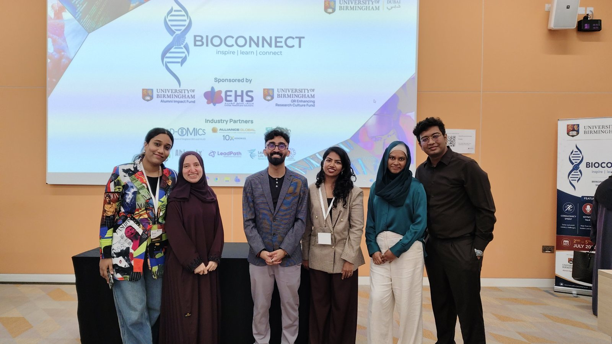

## Colombo, 2024 · Growing iron into leafy greens

::: {.beat}
[January 2024]{.beat-when}

It started with a number: iron deficiency affects around two billion people, and it is rising in Sri Lanka. For my final-year research at BMS School of Science, studying for a Northumbria University degree, I asked whether two greens that Sri Lankan families already cook every week, mukunuwenna and kangkung, could be grown hydroponically to carry more iron.
:::

::: {.beat}
[February 2024]{.beat-when}

February was preparation: planning the experiment, sourcing seed and cuttings, and setting up coconut-coir plugs for propagation.
:::

::: {.photo-grid}
{group="1-colombo"}

:::

::: {.beat}
[March 2024]{.beat-when}

In March the plants went in. Kangkung and mukunuwenna were transplanted into the channels of a nutrient film technique (NFT) rig, with a second set grown in coconut coir, the low-cost alternative. Alongside, I prepared leaves and tested the extraction method I would use later.
:::

::: {.photo-grid}
{group="1-colombo"}

{group="1-colombo"}

{group="1-colombo"}

{group="1-colombo"}

{group="1-colombo"}

:::

::: {.beat}
[April 2024]{.beat-when}

April was growth: five weeks of measuring height and counting leaves every week, across three iron levels in each system.
:::

::: {.photo-grid}
{group="1-colombo"}

{group="1-colombo"}

{group="1-colombo"}

:::

::: {.beat}
[May 2024]{.beat-when}

In May came the harvest. Leaves were dried, ground and extracted, ready for the laboratory.
:::

::: {.photo-grid}
{group="1-colombo"}

{group="1-colombo"}

:::

::: {.beat}
[June 2024]{.beat-when}

June was spent at the bench: standard curves, colorimetric assays on the spectrophotometer, and careful weighing for protein, carbohydrate, phenolic, flavonoid and antioxidant measurements.
:::

::: {.photo-grid}
{group="1-colombo"}

{group="1-colombo"}

{group="1-colombo"}

:::

::: {.beat}
[July 2024]{.beat-when}

In July I screened the extracts for bioactive compounds such as tannins and steroids, and pulled the results together.
:::

::: {.photo-grid}
{group="1-colombo"}

{group="1-colombo"}

{group="1-colombo"}

:::

::: {.beat}
[August 2024]{.beat-when}

On 6 August 2024 I submitted the dissertation. It earned 84% and contributed to a First Class Honours degree, confirmed in November.
:::

::: {.beat}
[November 2024]{.beat-when}

In November I presented the work orally at ICIET 2024 at the University of Sri Jayewardenepura, and the abstract was published in the proceedings. [Read the full project](../projects/iron-biofortification/).
:::

## Dubai, 2025–2026 · From plants to pixels

::: {.beat}
[September 2025]{.beat-when}

In September 2025 I began an MSc in Bioinformatics at the University of Birmingham Dubai, on a 50% 125th Anniversary Scholarship. The goal: take the plant science I knew from the bench and learn to answer it with data.
:::

::: {.beat}
[November 2025]{.beat-when}

In November I went to the 3rd Healthy Longevity Symposium at Khalifa University in Abu Dhabi.
:::

::: {.photo-grid}
{group="2-dubai"}

:::

::: {.beat}
[December 2025]{.beat-when}

December brought the Genomics and NGS module, where the team project was to reproduce, or improve on, a published analysis. My work rebuilt a barley RNA-seq study on the university’s BlueBEAR supercomputer.
:::

::: {.photo-grid}
{group="2-dubai"}

{group="2-dubai"}

:::

::: {.beat}
[February 2026]{.beat-when}

From February to May 2026 I was a research intern at the University of Sharjah, analysing a public potato microarray dataset to see how roots respond to phosphate starvation. That month I also visited WHX Labs Dubai. [The internship project](../projects/potato-phosphate/).
:::

::: {.photo-grid}
{group="2-dubai"}

:::

::: {.beat}
[May 2026]{.beat-when}

By May I had finished the taught modules with an 81% average and was deep into my MSc research: could drone images of more than 250 potato varieties reveal late blight?
:::

::: {.photo-grid}
{group="2-dubai"}

:::

::: {.beat}
[July 2026]{.beat-when}

In July my team of three took first place in the Abiomix rare-disease challenge at the BioConnect 2026 sprint, and the project went on to the BioConnect Accelerator. [The project](../projects/rare-disease-reanalysis/).
:::

::: {.photo-grid}
{group="2-dubai"}

{group="2-dubai"}

{group="2-dubai"}

:::

::: {.beat}
[September 2026]{.beat-when}

In September I defended my thesis, and the next day our rare-disease work was shown as a poster at the UAE Rare Disease Society Congress. [The thesis](../projects/potato-late-blight/).
:::

::: {.photo-grid}
{group="2-dubai"}

:::

