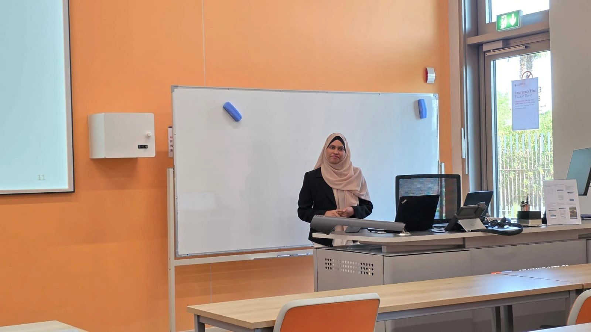
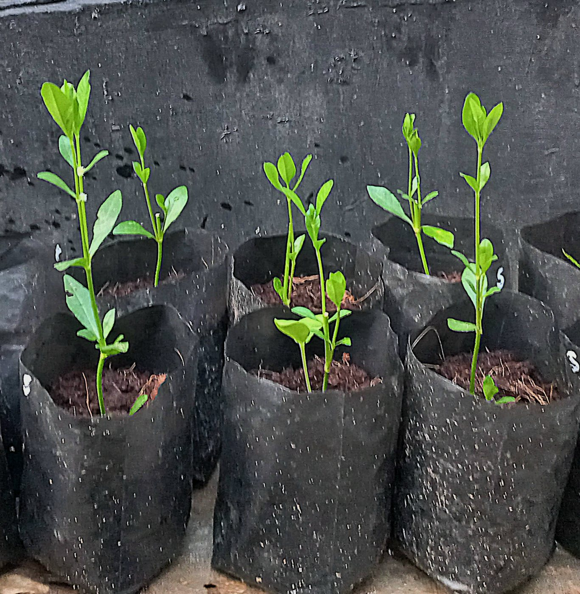
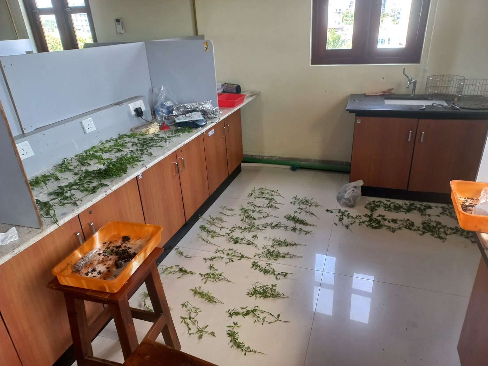
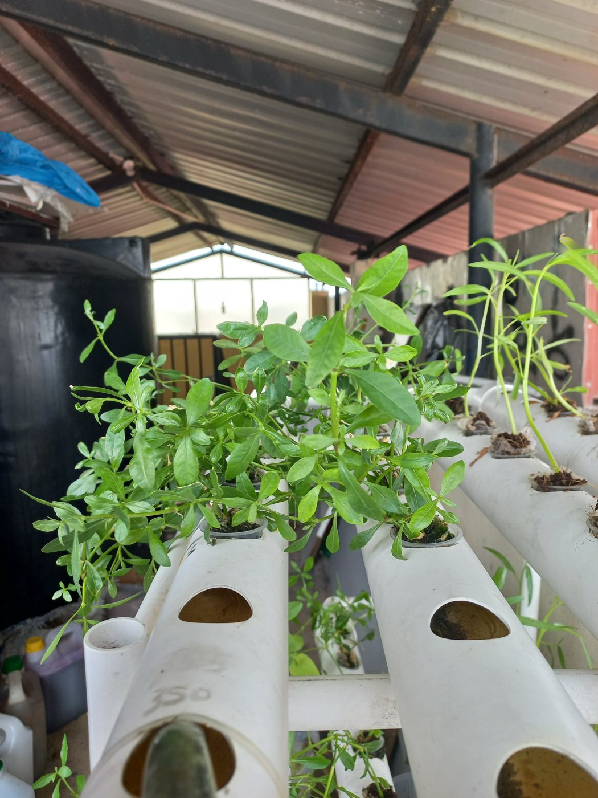
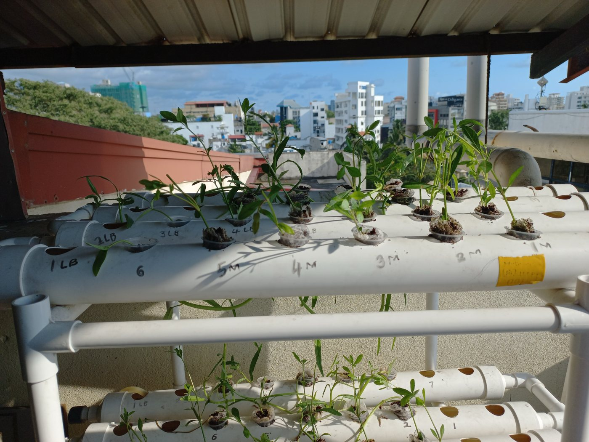
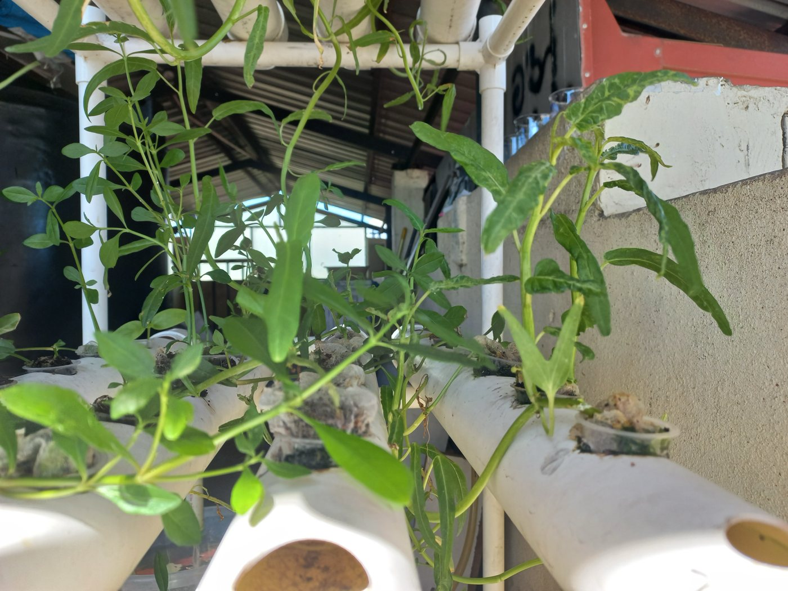
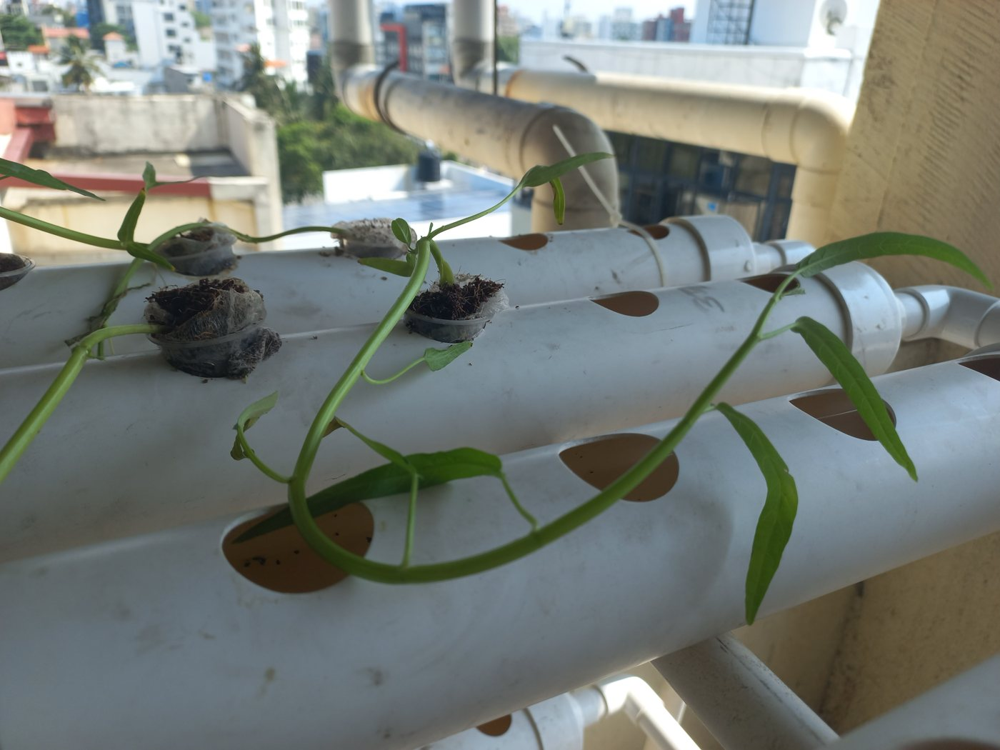

## MSc journey

MSc Bioinformatics at the University of Birmingham Dubai, 2025–2026: a research internship at the University of Sharjah, a four-day consultancy sprint, and a thesis on detecting potato late blight from drone imagery. [Read about the thesis](../projects/potato-late-blight/).

::: {.photo-grid}
{group="1-msc-journey"}

:::

## BSc journey

BSc (Hons) Biotechnology at BMS School of Science, Colombo, for a Northumbria University degree, 2024: five weeks growing mukunuwenna and kangkung hydroponically, then the lab work that followed. The research was published in the ICIET 2024 proceedings. [Read about the project](../projects/iron-biofortification/).

::: {.photo-grid}
{group="2-bsc-journey"}

{group="2-bsc-journey"}

{group="2-bsc-journey"}

{group="2-bsc-journey"}

{group="2-bsc-journey"}

{group="2-bsc-journey"}

{group="2-bsc-journey"}

{group="2-bsc-journey"}

{group="2-bsc-journey"}

{group="2-bsc-journey"}

{group="2-bsc-journey"}

:::

