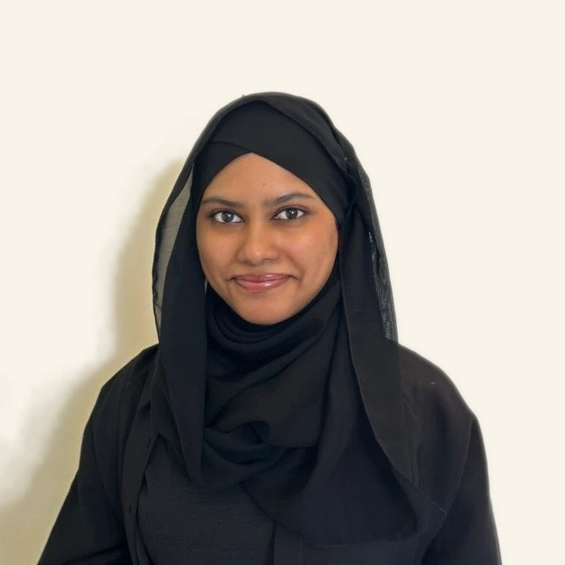

```{=html}
<style>#title-block-header { display: none; } #quarto-content > * { padding-top: 0; }</style>

<section class="band dark">
  <div class="band-inner hero">
    <div>
      <div class="kicker">Bioinformatics · Plant science</div>
      <h1>Halireena Rushdiha</h1>
      <div class="role">MSc Bioinformatics candidate, University of Birmingham Dubai</div>
      <p class="lead">
        Plant scientist moving into bioinformatics, with a First Class BSc (Hons) in Biotechnology.
        My research applies machine learning to crop disease detection, with an emphasis on
        validation that generalises to unseen varieties. I am seeking internships and entry-level
        roles in bioinformatics, plant genomics and agritech.
      </p>
      <div class="btn-row">
        <a class="btn-cute accent" href="projects.html">Selected work</a>
        <a class="btn-cute light" href="timeline.html">My timeline</a>
        <a class="btn-cute light" href="cv.html">Download CV</a>
        <a class="btn-cute light" href="contact.html">Contact</a>
      </div>
    </div>
    <div class="portrait-wrap"></div>
  </div>
</section>

<section class="band facts-band">
  <div class="band-inner facts">
    <div><span class="k">Education</span><span class="v">MSc Bioinformatics, University of Birmingham Dubai (Sep 2025 – present)</span><span class="v">BSc (Hons) Biotechnology, First Class, Northumbria University at BMS Colombo (2024)</span></div>
    <div><span class="k">Based in</span><span class="v">Dubai, United Arab Emirates</span><span class="v">Open to roles in the UAE and internationally</span></div>
    <div><span class="k">Contact</span><span class="v">halireenarush@gmail.com</span><span class="v"><a href="contact.html">Contact form and CV request</a> · <a href="https://www.linkedin.com/in/halireena">LinkedIn</a></span></div>
  </div>
</section>

<section class="band">
  <div class="band-inner">
    <div class="band-head"><h2>Selected work</h2><a class="more" href="projects.html">All projects →</a></div>
    <div class="proj-grid">
      <a class="proj-card wide" href="projects/potato-late-blight/">
        <div class="img"></div>
        <div class="body">
          <div class="tag">MSc research project, Apr 2026 – present · Machine learning · Remote sensing</div>
          <h3>Detection of potato late blight from UAV multispectral imagery</h3>
          <p>Models trained on vegetation-index and texture features from more than 250 potato
            varieties were evaluated with variety-grouped cross-validation, a second flight and
            permutation tests. The disease signal is statistically significant but modest, and
            label reliability sets the ceiling. A conference abstract and paper are in preparation.</p>
          <div class="result">
            <span><strong>0.394</strong>macro-F1 (baseline 0.308)</span>
            <span><strong>p = 0.004</strong>permutation test</span>
            <span><strong>0.617</strong>healthy vs diseased</span>
          </div>
        </div>
      </a>
      <a class="proj-card wide" href="projects/iron-biofortification/">
        <div class="img"></div>
        <div class="body">
          <div class="tag">BSc dissertation, 2024 · Published · Oral presentation at ICIET 2024</div>
          <h3>Iron biofortification of leafy greens using hydroponics</h3>
          <p>I grew mukunuwenna and kangkung in nutrient-film and coconut-coir systems at three iron
            levels, then measured iron, nutrition and antioxidant content. Coconut coir raised iron in
            mukunuwenna about 3.7-fold, pointing to a low-cost biofortification route for Sri Lanka.</p>
          <div class="result">
            <span><strong>3.7×</strong>iron uptake, coconut coir</span>
            <span><strong>20.3 ppm</strong>highest iron content</span>
            <span><strong>ICIET 2024</strong>published abstract</span>
          </div>
        </div>
      </a>
    </div>
    <div class="work-list">
      <a href="projects/potato-phosphate/"><div><h3>Transcriptomic response of potato to phosphate starvation</h3><p>Five-stage R pipeline (limma, clusterProfiler, biomaRt, ape) on public microarray data from four cultivars. Bioinformatics Research Intern, University of Sharjah.</p></div><div class="meta">Internship · Feb–May 2026</div></a>
      <a href="projects/rare-disease-reanalysis/"><div><h3>Prioritising unsolved rare-disease cases for genomic re-analysis</h3><p>First-place team pipeline for the Abiomix challenge at the BioConnect 2026 Consultancy Sprint, later a congress poster: phenotype extraction, a rule-based ACMG kernel (96.3% concordance with ClinVar) and explainable case ranking.</p></div><div class="meta">1st place · Jul 2026</div></a>
      <a href="projects/pumpkin-rbcl/"><div><h3>Amplification of the <em>rbcL</em> gene region in Sri Lankan pumpkin varieties</h3><p>DNA extraction, PCR and gel electrophoresis. Higher Diploma dissertation, Distinction.</p></div><div class="meta">Higher Diploma · 2024</div></a>
    </div>
  </div>
</section>

<section class="band">
  <div class="band-inner">
    <div class="band-head"><h2>Recent writing</h2><a class="more" href="blog.html">All posts →</a></div>
    <div class="post-list">
      <a href="blog/2026-10-04-my-33-week-plan/"><div class="date">4 October 2026</div><h3>A 33-week plan for independent bioinformatics work</h3><p>From running tools to building analyses from scratch.</p></a>
      <a href="blog/2026-10-02-honest-validation/"><div class="date">2 October 2026</div><h3>Why a lower score was the better result</h3><p>Variety-grouped validation in a 250-variety field trial.</p></a>
      <a href="blog/2026-10-03-hello-world/"><div class="date">3 October 2026</div><h3>About this site</h3><p>Purpose and structure of this site.</p></a>
    </div>
  </div>
</section>

<section class="band dark">
  <div class="band-inner contact-band">
    <div>
      <h2>Contact</h2>
      <p>I am seeking internships and entry-level roles in bioinformatics, plant science and agritech
        in the UAE and internationally.</p>
    </div>
    <div class="contact-links">
      <a href="contact.html">Contact form and CV request</a>
      <a href="https://www.linkedin.com/in/halireena">linkedin.com/in/halireena</a>
      <a href="https://github.com/halireena">github.com/halireena</a>
    </div>
  </div>
</section>
```
