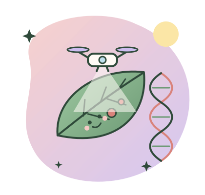
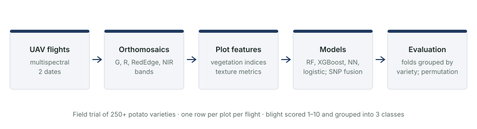

```{=html}
<style>#title-block-header { display: none; }</style>

<div class="home-wrap">
<section class="hero">
  <div>
    <span class="hello">👋 Hi, I'm Halireena!</span>
    <h1>I turn <span class="accent">plant data</span> into honest answers.</h1>
    <p class="lead">
      Bioinformatician with an MSc from the University of Birmingham (Dubai). I love drones, potatoes,
      genomes and making sure a model's score means what it says.
    </p>
    <p class="lead">🌱 <strong>Open to internships and graduate roles in bioinformatics.</strong></p>
    <div class="btn-row">
      <a class="btn-cute solid" href="projects.html">✨ See my projects</a>
      <a class="btn-cute" href="cv.html">📄 My CV</a>
      <a class="btn-cute" href="https://github.com/halireena">🐙 GitHub</a>
    </div>
  </div>
  <div style="text-align:center"></div>
</section>

<p class="section-label">What I do</p>
<h2>Things I'm good at</h2>
<div class="card-grid">
  <div class="cute-card"><div class="icon bg-sky">🛸</div><h3>Remote sensing</h3>
    <p>Turning UAV multispectral imagery into per-plot vegetation indices and texture features.</p></div>
  <div class="cute-card"><div class="icon bg-blush">🤖</div><h3>Machine learning</h3>
    <p>Random forests, XGBoost and neural nets, tested with folds grouped by variety so the scores are honest.</p></div>
  <div class="cute-card"><div class="icon bg-lavender">🧬</div><h3>Genomics</h3>
    <p>SNP data, GWAS, variant calling and multi-omics, learned by reproducing published analyses.</p></div>
  <div class="cute-card"><div class="icon bg-butter">🧰</div><h3>Reproducible code</h3>
    <p>R and Python packages with tests, GitHub Actions, and one script that rebuilds every result.</p></div>
</div>

<p class="section-label">Featured project</p>
<h2>My MSc thesis</h2>
<div class="feature">
  <div></div>
  <div>
    <h3>🥔 Spotting potato late blight from the sky</h3>
    <p>Can drone images tell which potato plots have late blight, across about <strong>280 varieties</strong>?
      I built the full pipeline and tested it strictly. The signal is real but smaller than most
      published papers suggest.</p>
    <div class="btn-row"><a class="btn-cute solid" href="projects/potato-late-blight/">Read the project →</a></div>
  </div>
</div>

<div class="stats">
  <div class="stat"><div class="num">~280</div><div class="lbl">potato varieties</div></div>
  <div class="stat"><div class="num">2</div><div class="lbl">UAV flights</div></div>
  <div class="stat"><div class="num">0.617</div><div class="lbl">macro-F1, healthy vs diseased</div></div>
  <div class="stat"><div class="num">0.004</div><div class="lbl">p-value, permutation test</div></div>
</div>

<p class="section-label">Toolbox</p>
<h2>Languages & tools</h2>
<div class="chips">
  <span class="chip">Python</span><span class="chip">R</span><span class="chip">scikit-learn</span>
  <span class="chip">XGBoost</span><span class="chip">pandas</span><span class="chip">tidyverse</span>
  <span class="chip">HPC (BlueBEAR)</span><span class="chip">Git & GitHub Actions</span><span class="chip">Quarto</span>
  <span class="chip">GWAS</span><span class="chip">Variant calling</span><span class="chip">Multispectral imaging</span>
  <span class="chip">Permutation tests</span><span class="chip">Bootstrap CIs</span><span class="chip">testthat & pytest</span>
</div>

<div class="feature" style="background: linear-gradient(135deg, #FBE6A6, #F6C9C4); text-align:center; display:block">
  <h3>💌 Let's work together</h3>
  <p>I'm looking for internships and graduate roles in bioinformatics, especially in plant science and agri-tech.</p>
  <div class="btn-row" style="justify-content:center">
    <a class="btn-cute solid" href="https://github.com/halireena">Say hi on GitHub</a>
  </div>
</div>
</div>
```
