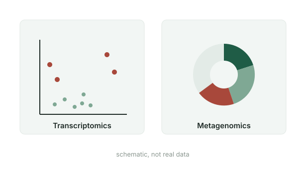

```{=html}
<style>#title-block-header { display: none; } #quarto-content > * { padding-top: 0; }</style>

<section class="band dark">
  <div class="band-inner hero">
    <div>
      <div class="kicker">Bioinformatics · Plant science · Dubai</div>
      <h1>Hi, I'm Halireena. I turn <em>plant data</em> into evidence.</h1>
      <p class="lead">
        Plant scientist moving into bioinformatics. I work on crop disease, stress and the genetics
        behind them, with an emphasis on analysis that holds up to scrutiny.
      </p>
      <div class="btn-row">
        <a class="btn-cute accent" href="projects.html"><i class="bi bi-grid-1x2"></i> See my work</a>
        <a class="btn-cute light" href="about.html"><i class="bi bi-person"></i> About me</a>
        <a class="btn-cute light" href="cv.html"><i class="bi bi-file-earmark-text"></i> CV</a>
      </div>
      <div class="hero-facts">
        <div><strong>MSc</strong>Bioinformatics, Birmingham Dubai</div>
        <div><strong>First Class</strong>BSc (Hons) Biotechnology</div>
        <div><strong>250+</strong>potato varieties analysed</div>
      </div>
    </div>
    <div><div class="portrait" aria-label="Monogram placeholder">HM</div></div>
  </div>
</section>

<section class="band">
  <div class="band-inner">
    <div class="band-head"><h2>Featured work</h2><a class="more" href="projects.html">All projects <i class="bi bi-arrow-right"></i></a></div>
    <p class="intro">My strongest project first, then the work that led to it.</p>
    <div class="proj-grid">
      <a class="proj-card wide" href="projects/potato-late-blight/">
        <div class="img"></div>
        <div class="body">
          <div class="tag">MSc thesis · Machine learning · Remote sensing</div>
          <h3>Detecting potato late blight from drone imagery</h3>
          <p>Multispectral UAV images of more than 250 potato varieties, evaluated with variety-grouped
            cross-validation and permutation tests. The disease signal is real but smaller than most
            published studies claim. A conference abstract and paper are in preparation.</p>
          <div class="result">
            <span><strong>0.394</strong>macro-F1 vs 0.308 baseline</span>
            <span><strong>p = 0.004</strong>permutation test</span>
            <span><strong>0.617</strong>healthy vs diseased</span>
          </div>
        </div>
      </a>
      <a class="proj-card" href="projects/iron-biofortification/">
        <div class="img"></div>
        <div class="body"><div class="tag">BSc dissertation · Published abstract</div>
          <h3>Iron biofortification of leafy greens</h3><p>Comparing hydroponic techniques to raise the iron content of two vegetables eaten in Sri Lanka.</p></div>
      </a>
      <a class="proj-card" href="projects/msc-analyses/">
        <div class="img"></div>
        <div class="body"><div class="tag">MSc coursework · R</div>
          <h3>Transcriptomics, GWAS and metagenomics</h3><p>Three MSc analyses using limma, PLINK and GAPIT3, now being rebuilt in my own code.</p></div>
      </a>
      <a class="proj-card" href="projects/pumpkin-rbcl/">
        <div class="img"></div>
        <div class="body"><div class="tag">Higher Diploma · Molecular biology</div>
          <h3>Amplifying the rbcL gene in pumpkin varieties</h3><p>DNA extraction, PCR and gel electrophoresis on local pumpkin varieties in Sri Lanka.</p></div>
      </a>
    </div>
  </div>
</section>

<section class="band sand">
  <div class="band-inner">
    <h2>What I do</h2>
    <p class="intro">Three things I bring to a team.</p>
    <div class="info-grid">
      <div class="info"><i class="bi bi-bar-chart-line"></i><h3>Analysis you can trust</h3><p>Grouped cross-validation, permutation tests and baselines, so a result means what it says.</p></div>
      <div class="info"><i class="bi bi-flower2"></i><h3>Plant biology first</h3><p>Lab experience in DNA extraction, PCR and hydroponics, so the data always has biological context.</p></div>
      <div class="info"><i class="bi bi-pencil-square"></i><h3>Clear write-ups</h3><p>Scientific reports, a published abstract and clinical documentation experience.</p></div>
    </div>
  </div>
</section>

<section class="band">
  <div class="band-inner">
    <div class="band-head"><h2>Latest writing</h2><a class="more" href="blog.html">All posts <i class="bi bi-arrow-right"></i></a></div>
    <div class="post-list">
      <a href="blog/2026-10-05-building-a-portfolio/"><div class="date">5 October 2026</div><h3>What makes a research portfolio worth reading?</h3><p>Notes from four guides, and how I applied them to this site.</p></a>
      <a href="blog/2026-10-04-my-33-week-plan/"><div class="date">4 October 2026</div><h3>My 33-week plan to write my own bioinformatics code</h3><p>From running tools to building analyses myself.</p></a>
      <a href="blog/2026-10-02-honest-validation/"><div class="date">2 October 2026</div><h3>Why my model's score went down (and why that's good)</h3><p>What 250 potato varieties taught me about validation.</p></a>
    </div>
  </div>
</section>

<section class="band dark">
  <div class="band-inner contact-band">
    <div>
      <h2>Let's talk</h2>
      <p>I'm looking for internships and entry-level roles in bioinformatics, plant science and agritech,
        in the UAE / Gulf or the Netherlands. If you have a project where plant biology meets data, I'd love to hear about it.</p>
    </div>
    <div class="contact-links">
      <a href="mailto:halireenarush@gmail.com"><i class="bi bi-envelope"></i> halireenarush@gmail.com</a>
      <a href="https://www.linkedin.com/in/halireena"><i class="bi bi-linkedin"></i> linkedin.com/in/halireena</a>
      <a href="https://github.com/halireena"><i class="bi bi-github"></i> github.com/halireena</a>
    </div>
  </div>
</section>
```
