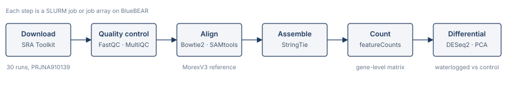
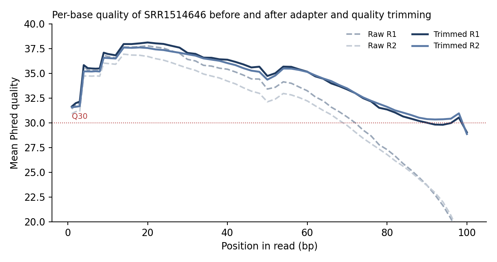

[← All projects](../../projects.qmd){.back-link}

::: {.question-box}
Can a published RNA-seq result be reproduced from the raw reads, end to end, on a shared supercomputer?
:::

::: {.stats}
::: {.stat}
[30]{.num}
[RNA-seq runs]{.lbl}
:::
::: {.stat}
[5]{.num}
[barley cultivars]{.lbl}
:::
::: {.stat}
[4.3 GB]{.num}
[reference genome]{.lbl}
:::
::: {.stat}
[10]{.num}
[scripts]{.lbl}
:::
:::

**Group project · Genomics & Next Generation Sequencing · University of Birmingham Dubai · autumn 2025.**
Presented as a team in December 2025. The pipeline ran on the University of Birmingham's BlueBEAR
HPC cluster, so the code and data stayed on university systems; the scripts are summarised here.

## The study

Miricescu and colleagues (2023) sequenced the roots of five barley cultivars (Golden Promise,
Infinity, Passport, Pilastro and Regina) after ten days of waterlogging or control conditions,
three plants per group. The data are public (NCBI BioProject PRJNA910139): 30 single-end,
50 bp BGISEQ-500 libraries. We set out to rebuild the analysis from the raw reads to the paper's
headline figure, the number of differentially expressed genes per cultivar.

## The pipeline

{fig-alt="Six-box pipeline: download, quality control, align, assemble, count, differential expression"}

1. **Reference.** Downloaded the MorexV3 barley genome from IPK (4.3 GB FASTA) and its
   annotation, and converted the GFF3 to GTF.
2. **Reads.** Pulled all 30 runs from the SRA with `fasterq-dump` as a job array over the
   accession list, then gzipped them.
3. **Quality control.** FastQC on every file as an array job, collected into one MultiQC report.
4. **Alignment.** Built a Bowtie2 index of MorexV3 (32 CPUs, 128 GB), aligned each sample and
   piped straight into SAMtools for sorting and indexing.
5. **Assembly and counting.** StringTie per sample for gene abundances, then featureCounts over
   all BAM files for a gene-level count matrix.
6. **Differential expression.** In R: cleaned the SRA metadata to cultivar and treatment, built
   the DESeq2 object (`~ condition`), tested waterlogged versus control within each cultivar
   (padj < 0.05), and plotted DEG counts per cultivar in the style of the paper's Figure 3 and a
   PCA of variance-stabilised counts coloured by cultivar and treatment.

Every script starts with `set -euo pipefail`, loads its software through the cluster's module
system, picks its sample from the accession list by array index, and stops with a clear message
if an input file is missing.

## A smaller warm-up: cleaning paired-end reads

Before the group project, an individual exercise on one paired-end human RNA-seq run
(SRR1514646, 3.6 million read pairs) practised the quality-control decisions on their own:
FastQC on the raw reads, adapter and quality trimming with cutadapt, FastQC again, and a small
Bash script that computes read count, total bases, mean length and mean Phred score directly from
the FASTQ files with `awk`.

{fig-alt="Line chart of mean Phred quality by read position for raw and trimmed forward and reverse reads"}

With the stricter settings (quality 25, minimum length 50 bp), 2.7% of forward and 2.3% of reverse
reads carried adapter, 13.2% of bases were quality-trimmed, and 84.8% of pairs survived.

## What I learned

- How to structure an HPC analysis so it is restartable: one job per stage, one array task per
  sample, logs for each, and inputs checked before anything heavy runs.
- Trimming is a trade-off. Stricter quality thresholds lose whole read pairs (15% here), so the
  threshold has to be justified rather than defaulted.
- Reproducing a paper means matching its *decisions* (reference version, counting rules,
  the contrast tested), not just its tools.

## Reference

Miricescu A. et al. (2023). Transcriptomic and physiological responses of barley cultivars to
waterlogging. Data: NCBI BioProject
[PRJNA910139](https://www.ncbi.nlm.nih.gov/bioproject/PRJNA910139).
