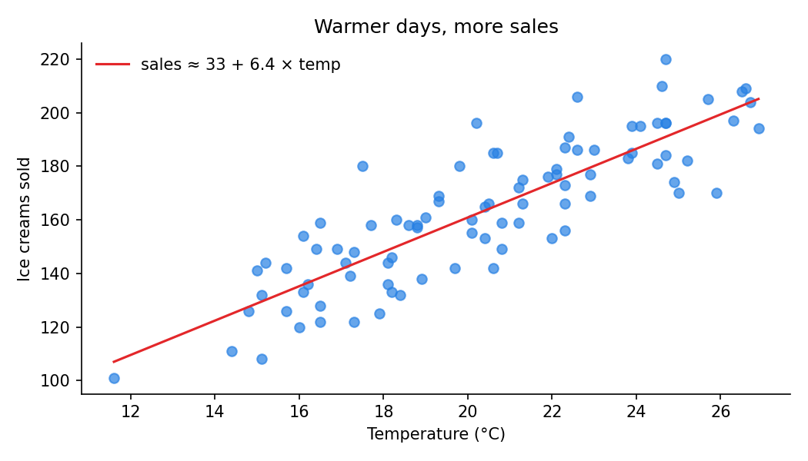

<!--
  TEMPLATE: copy this whole folder to start a new project.
  Keep the six headings below and replace the text under each one.
-->

## The question

*What are you trying to find out, and why does it matter?* One or two sentences.

Does the daily temperature predict how many ice creams a small shop sells?
If so, the shop could use the weather forecast to plan stock.

## The data

*Where did the data come from, how big is it, what does each row mean?*

- **Source:** a simulated dataset made by [`make_figures.py`](make_figures.py)
  (replace this with your real source and a link).
- **Size:** 90 rows, one per day.
- **Columns:** `day`, `temperature_c`, `sales`.
- **Download:** [data.csv](data.csv)

## Methods

*What did you do, step by step? Keep it readable for a non-specialist.*

1. Plotted daily sales over time to look for a trend.
2. Plotted sales against temperature.
3. Fitted a straight line (ordinary least squares) to estimate how many
   extra ice creams are sold for each extra degree.

```python
slope = sum((t - mean_t) * (s - mean_s) for t, s in zip(temps, sales)) / \
        sum((t - mean_t) ** 2 for t in temps)
```

## Results

{#fig-sales fig-alt="Line chart of daily ice cream sales over 90 days, trending upward."}

{#fig-scatter fig-alt="Scatter plot of sales against temperature with an upward fitted line."}

@fig-sales shows sales climbing through the season, and @fig-scatter shows
that temperature explains much of that rise: about **6 extra sales per °C**.

## What I learned

*Be honest and specific — this is the part employers read most closely.*

- A simple scatter plot often answers the question before any model does.
- Correlation is not causation: the season also brings holidays and tourists.
- Next time I'd add day-of-week to the model and test on held-out data.

## Code

All code for this project is on GitHub:
[github.com/halireena/example-project](https://github.com/halireena/example-project){.btn .btn-outline-primary}
