[← All projects](../../projects.qmd){.back-link}

::: {.question-box}
Can a low-cost hydroponic system grow everyday Sri Lankan leafy greens with more iron in them, and which system does it better?
:::

::: {.badges}
[Published: ICIET 2024 proceedings]{.badge-cute}
[Oral presentation, ICIET 2024]{.badge-cute}
[First Class Honours]{.badge-cute}
[Dean's List Award]{.badge-cute}
[BMS Best Student Award]{.badge-cute}
:::

::: {.stats}
::: {.stat}
[3.7×]{.num}
[more iron in coconut-coir mukunuwenna at 250 ppm than its control]{.lbl}
:::
::: {.stat}
[20.3 ppm]{.num}
[highest iron content, coconut-coir mukunuwenna]{.lbl}
:::
::: {.stat}
[12]{.num}
[study groups: 2 species × 2 systems × 3 iron levels]{.lbl}
:::
::: {.stat}
[7]{.num}
[analyses per group, from iron to antioxidants]{.lbl}
:::
:::

## Why this matters

Iron deficiency affects around two billion people worldwide, mostly children and women, and it is
rising in Sri Lanka, especially among women and adults over 40. Biofortification, growing crops
that carry more of a nutrient, can reach people without changing what they eat. Rice, beans and
pearl millet have been biofortified with iron, but very little work had looked at **leafy greens
grown hydroponically**.

I chose two greens that Sri Lankan families already cook every week: **mukunuwenna**
(*Alternanthera sessilis*) and **kangkung**, or water spinach (*Ipomoea aquatica*).

## From seed to sample

I propagated and grew the plants, recorded their growth every week, and prepared the extracts
and ran the biochemical assays myself. Iron content was measured by AAS at an external
analytical laboratory.

::: {.story}
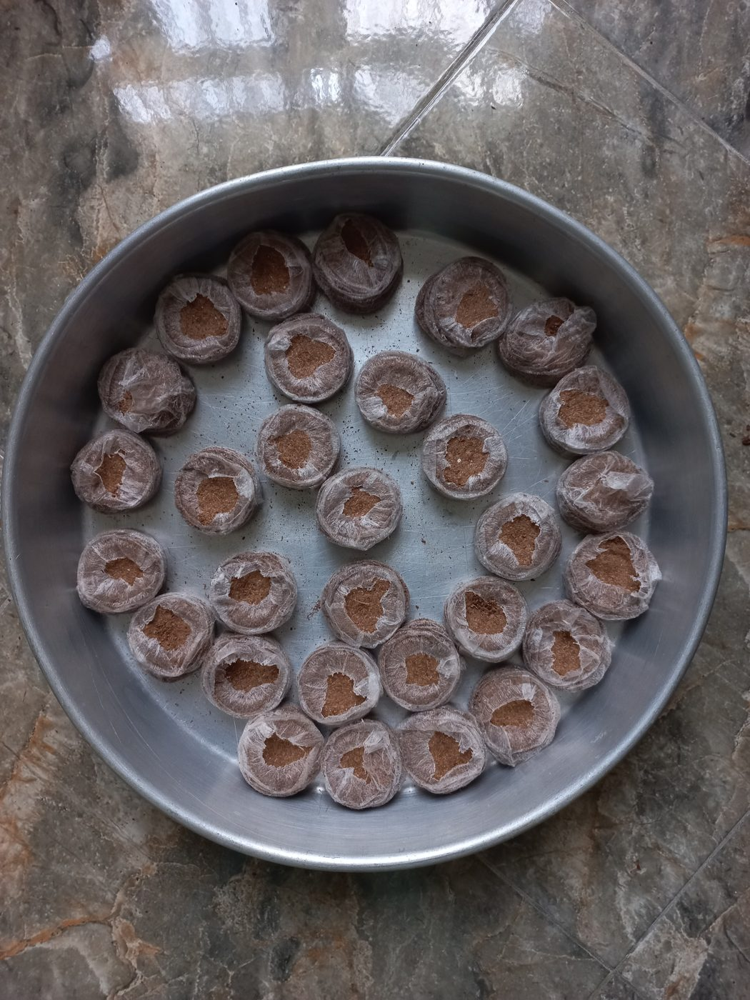{group="story"}

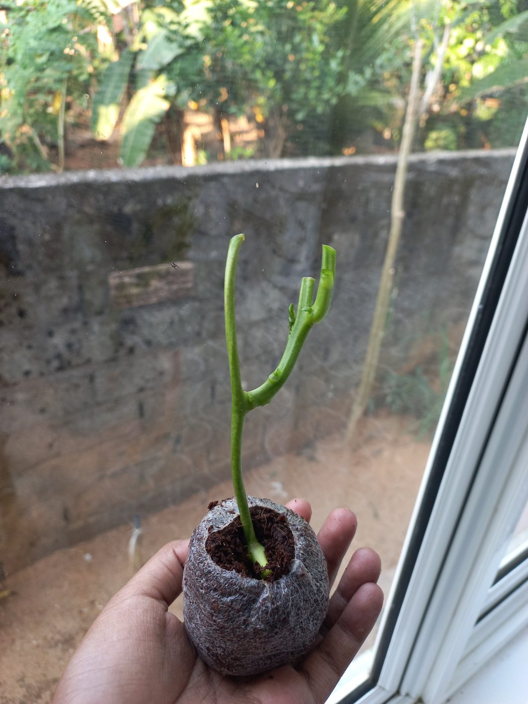{group="story"}

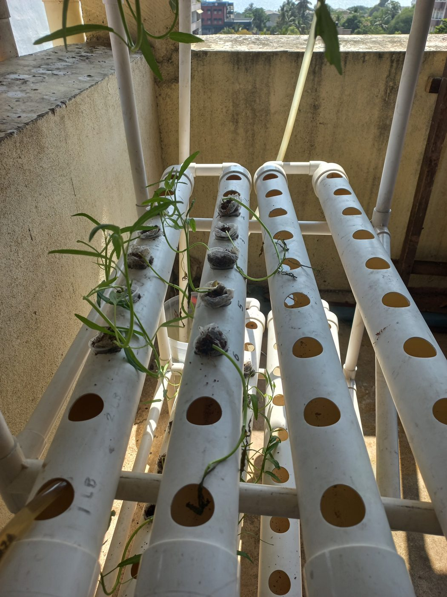{group="story"}

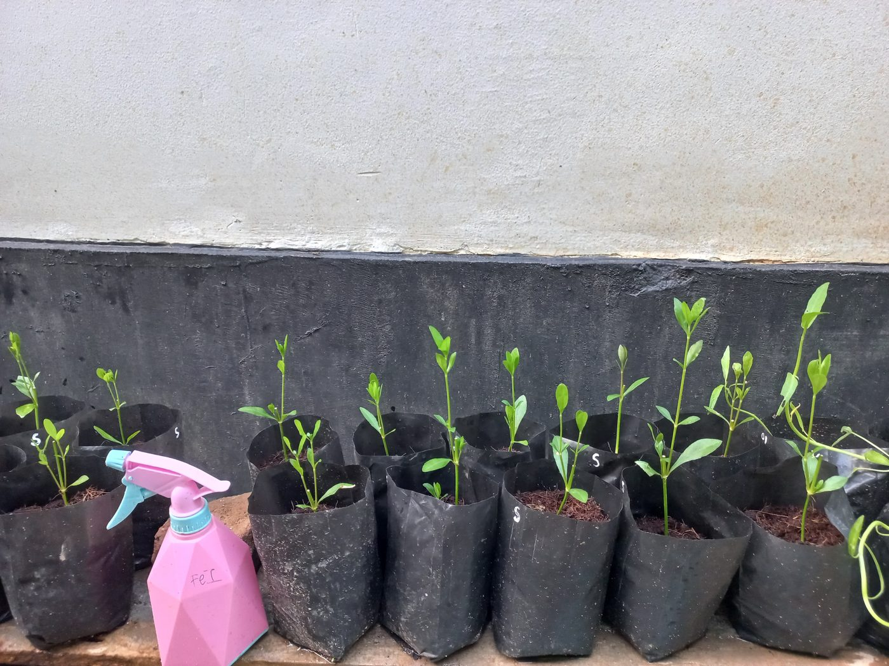{group="story"}

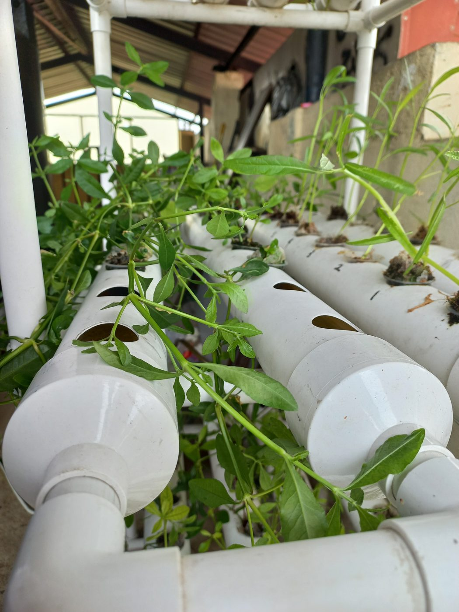{group="story"}

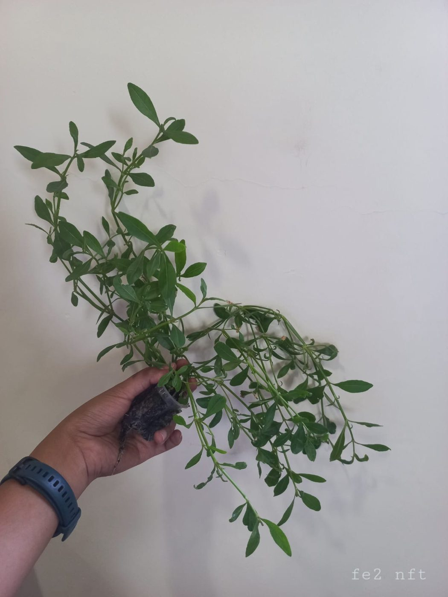{group="story"}

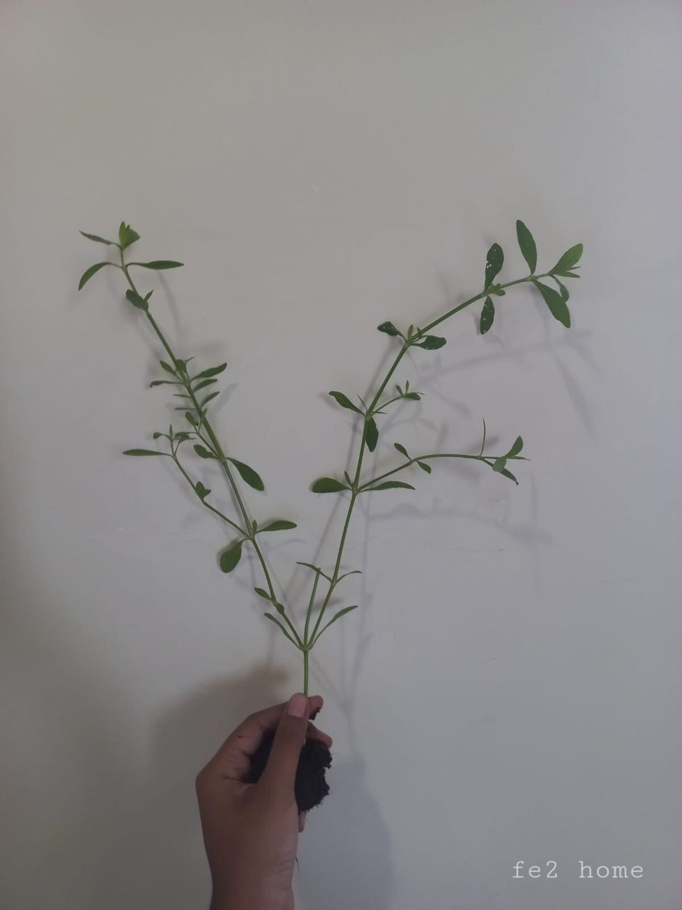{group="story"}

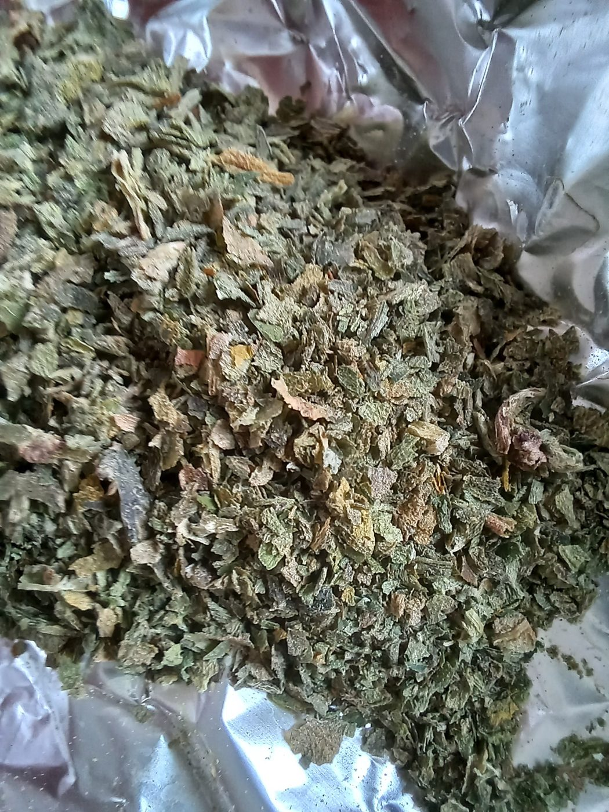{group="story"}

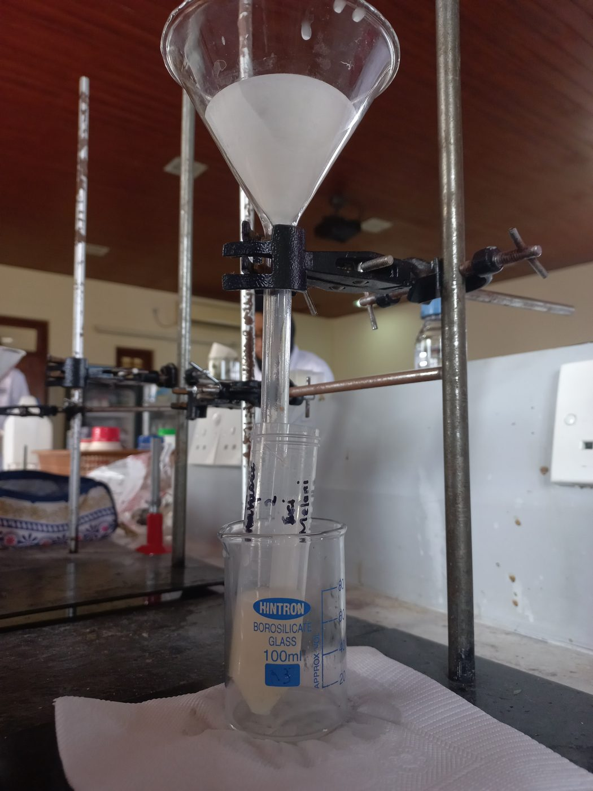{group="story"}

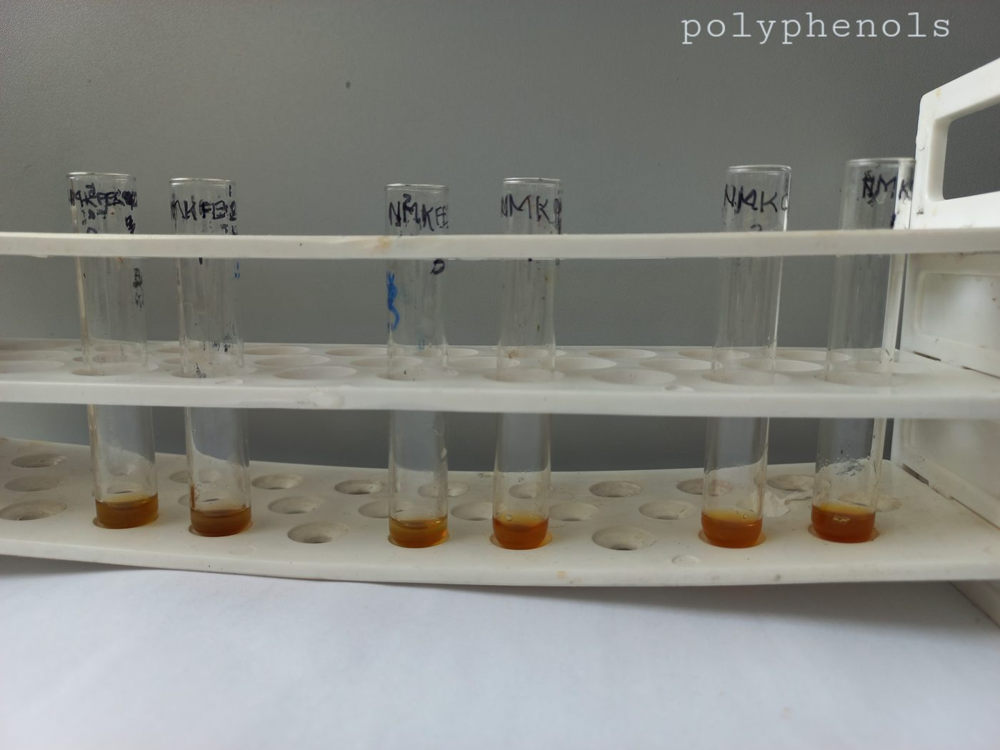{group="story"}
:::

## Study design

Both species were grown in both systems, with ten plants per group:

| | Kangkung | Mukunuwenna |
|---|---|---|
| **Nutrient film technique (NFT)** | growth + full biochemistry | growth + full biochemistry |
| **Coconut-coir cultivation (CCC)** | growth | growth + full biochemistry |

Each group received one of three nutrient solutions: a standard control (162.5 ppm iron) or one
of two iron-enriched solutions (200 ppm and 250 ppm). Height and leaf number were recorded every
week, and the plants were harvested at week five.

## Methods

- **Iron content:** atomic absorption spectrophotometry (AAS), carried out by an external laboratory.
- **Nutrition:** total protein (Lowry assay) and total carbohydrate (phenol–sulfuric acid assay).
- **Antioxidant profile:** DPPH radical scavenging, total phenolic content (Folin–Ciocalteu) and
  total flavonoid content (aluminium chloride assay).
- **Phytochemical screening:** qualitative tests for bioactive compounds such as tannins.
- **Statistics:** one-way ANOVA with LSD post-hoc comparisons in SPSS, and Pearson correlation.

## Results

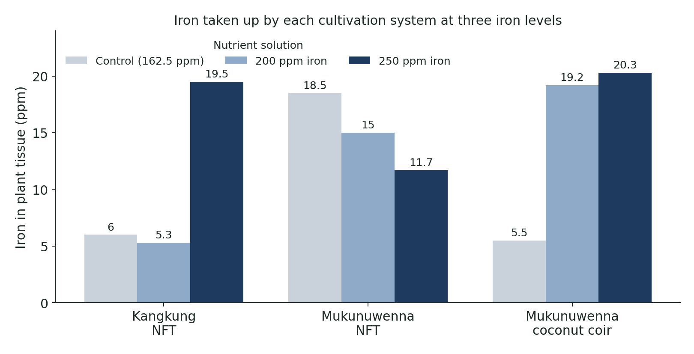{fig-alt="Grouped bar chart of iron content: kangkung NFT 6.0, 5.3, 19.5 ppm; mukunuwenna NFT 18.5, 15.0, 11.7 ppm; mukunuwenna coconut coir 5.5, 19.2, 20.3 ppm at control, 200 and 250 ppm iron"}

- **Coconut coir worked best for mukunuwenna.** Iron rose from 5.5 ppm (control) to 19.2 and
  20.3 ppm with the enriched solutions, about 3.7 times higher, and the differences were
  statistically significant (p < 0.05).
- **Kangkung in NFT also responded,** from 6.0 to 19.5 ppm at 250 ppm iron.
- **Mukunuwenna in NFT did the opposite,** taking up less iron as the iron level rose, although
  NFT gave the tallest plants, the most leaves and the heaviest harvest.
- **The 250 ppm coconut-coir group** also had the highest protein (2.84 g/100 g) and phenolic
  content (105.2 mg GAE/g), and phenolic content correlated with iron uptake (r = 0.565).
- **Trade-off:** antioxidant activity and carbohydrate content fell as iron rose in all three
  groups.

**Conclusion:** coconut-coir cultivation is a promising, low-cost route to iron-biofortified
mukunuwenna for resource-limited settings.

## Publication and presentation

**Mohomed, H.R.**, Abhayarathne, H.U., Pamalka, K.D.C., Gunarathne, G.G.L.L. and Liyanage, G.S.G.
(2024). *Iron biofortification of* Alternanthera sessilis *as a solution to alleviate iron
deficiency in Sri Lanka: a comparative study of hydroponics techniques.* Proceedings of the
International Conference on Innovation and Emerging Technologies (ICIET) 2024, Faculty of
Technology, University of Sri Jayewardenepura, Colombo, 21–22 November 2024. Abstract ID 058.
ISSN 2815-0317. **Oral presentation.**

## Limitations and next steps

- Iron was measured on pooled samples in duplicate, so the experiment needs repeating with more
  independent replicates.
- Coconut-coir kangkung was followed for growth only, so the two systems were compared
  biochemically for mukunuwenna alone.
- Next: test bioavailability (how much of the iron the body can absorb), and optimise growth
  conditions to keep yield high while raising iron.

## What I learned

- How to design and run a full plant experiment on my own, from propagation to statistics.
- Six laboratory assays, and why each needs its own standard curve and controls.
- How to turn a dissertation into a peer-reviewed conference abstract and present it to an
  audience.
