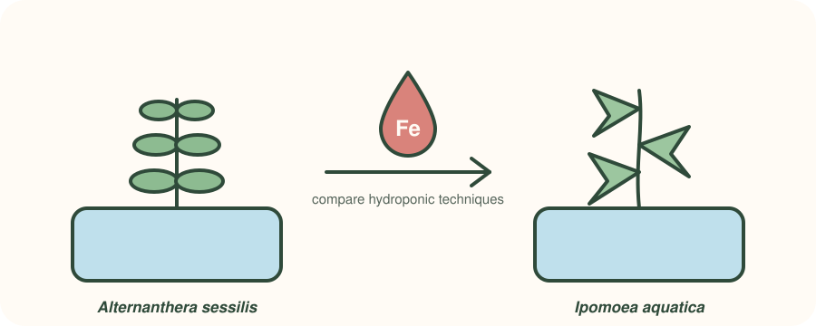

::: {.question-box}
Can hydroponic growing raise the iron content of everyday leafy vegetables, and which technique works best?
:::

::: {.badges}
[🥇 First Class Honours]{.badge-cute}
[📄 Published abstract]{.badge-cute}
[🏅 Dean's List Award]{.badge-cute}
[⭐ BMS Best Student Award]{.badge-cute}
:::

## The question

Iron deficiency is a common nutrition problem in Sri Lanka. Two leafy vegetables, *Alternanthera
sessilis* and *Ipomoea aquatica* (water spinach), are cheap and widely eaten. If they could carry
more iron, they could help close that gap without changing what people eat.

## The approach

{fig-alt="Illustration of Alternanthera sessilis and Ipomoea aquatica growing in hydroponic tanks with an iron droplet between them"}

I grew both species with different **hydroponic techniques** and compared how well each one raised
the plants' iron content. This was my dissertation for the BSc (Hons) Biotechnology at the
University of Northumbria, and the work was **published as an abstract**.

## What I learned

::: {.learned}
- How to plan and run a full plant experiment, from growing set-up to analysis and write-up.
- That biofortification sits where plant science meets public health, which is exactly where I want to work.
- How to turn a project into a short published abstract.
:::
