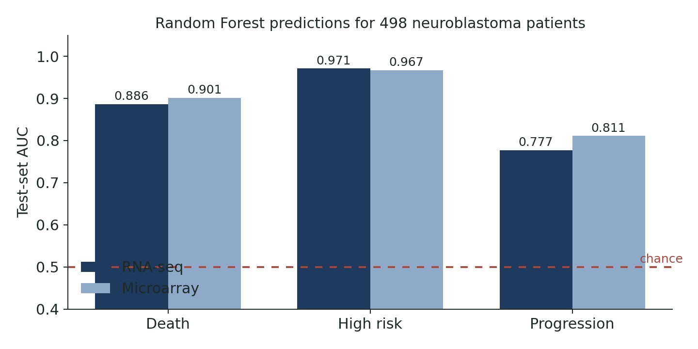

[← All projects](../../projects.qmd){.back-link}

::: {.question-box}
What did the taught part of the MSc actually involve? A selection of assessed projects, with what each one asked and found.
:::

The code and reports for these assignments stayed on university systems, so each is summarised
here rather than linked. Group work is marked as such, with my part described.

## Predicting neuroblastoma outcomes with machine learning

**Group report (4 members) · Data Analytics & Statistical Machine Learning · May 2026**

We compared RNA-seq and microarray profiles of the same **498 neuroblastoma patients**
(GSE62564) to predict three clinical outcomes. Features were chosen by a consensus of LASSO,
Random Forest and SVM-RFE inside **nested five-fold cross-validation**, so feature selection never
saw the test data, and final models were Random Forests.

{fig-alt="Grouped bar chart of test AUCs: death 0.886 and 0.901, high risk 0.971 and 0.967, progression 0.777 and 0.811 for RNA-seq and microarray"}

## Danube water and *Daphnia magna*: a data jamboree

**Group project (5 members) · Computational Biology · April–May 2026**

Water fleas (*Daphnia magna*) were exposed to river water from **12 sites along the Danube**, and
the team asked whether site chemistry changes their biology. **My parts were the positive-mode
metabolomics analysis and the ecotoxicological risk assessment** (toxic units, hazard index and a
Random Forest model). Site chemistry significantly shaped the metabolic response (PERMANOVA
R² = 10.5%, p = 0.016), with purine metabolism among the disrupted pathways.

## Optimising metabolomics preprocessing

**Group presentation · Metabolomics and Advanced Omics Technologies · March 2026**

We optimised the preprocessing of direct-infusion mass spectrometry (DIMS) data in Galaxy and
MetaboAnalyst, including the signal-to-noise threshold (3.5) and missing-value imputation (KNN,
k = 5).

## Replicating a barley RNA-seq study on a supercomputer

**Assignment · Genomics & Next Generation Sequencing · early 2026**

I rebuilt the RNA-seq pipeline of a published barley waterlogging study (Miricescu et al., 2023)
on the University of Birmingham's BlueBEAR HPC cluster: alignment with HISAT2 and STAR, read
counting with featureCounts, and differential expression with DESeq2.

## Reproducibility in proteomics

**Individual essay · Metabolomics and Advanced Omics Technologies · March 2026**

An 800-word essay on reproducibility in proteomics.

## What these taught me

- Validation design (nested cross-validation, held-out sites) matters as much as the model.
- Preprocessing choices in omics shape the results, so they need justifying.
- Working on HPC and in teams with clearly divided responsibilities.
