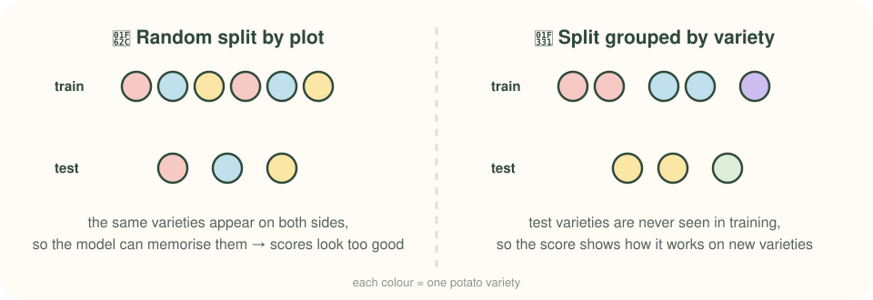
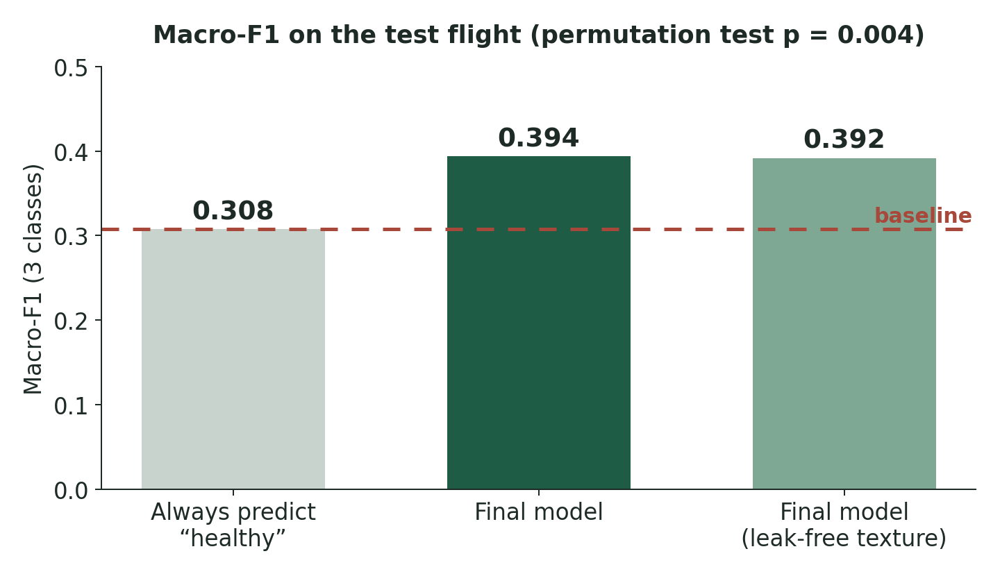
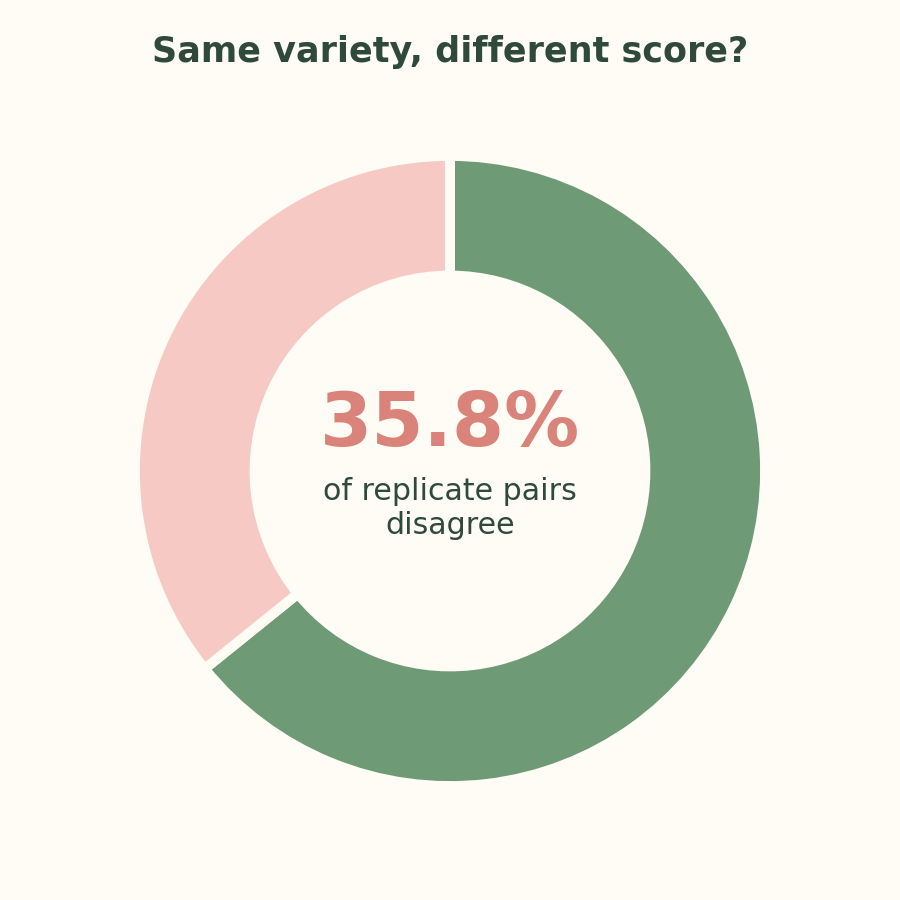

[← All projects](../../projects.qmd){.back-link}

::: {.question-box}
Can multispectral drone images tell which potato plots have late blight, even for varieties the model has never seen before?
:::

::: {.stats}
::: {.stat}
[250+]{.num}
[potato varieties]{.lbl}
:::
::: {.stat}
[2]{.num}
[UAV flights]{.lbl}
:::
::: {.stat}
[3]{.num}
[disease classes]{.lbl}
:::
::: {.stat}
[0.617]{.num}
[macro-F1, healthy vs diseased]{.lbl}
:::
:::

## The question

Late blight is one of the most damaging potato diseases, and scoring it by eye across a big
breeding trial is slow. Drones can photograph a whole field in minutes. Published papers report
66–98% accuracy for detecting blight from drone images, but most test on random splits within a
single field and only a few varieties.

I wanted to know: **how well does it really work across hundreds of varieties, when tested honestly?**

## The data

- **Imagery:** multispectral orthomosaics from two drone flights over a field trial,
  in four bands (Green, Red, RedEdge, NIR).
- **Plots:** one row per plot per flight, covering **more than 250 potato varieties** with replicate plots.
- **Labels:** blight scored by eye on a 1–10 scale, grouped into three classes: healthy, moderate, severe.
- **Genetics:** SNP data for the varieties, to test whether genetics adds anything on top of the images.

The data belongs to my research group, so it isn't public. Everything below is summary results.

## Methods

{fig-alt="Five-step workflow: UAV flights, orthomosaics, plot features, models, honest testing"}

1. **Features:** for each plot I computed vegetation indices and texture features from the four bands.
2. **Models:** random forest, XGBoost, a neural network and logistic regression, plus late fusion with SNP data.
3. **Honest testing:** cross-validation folds **grouped by variety**, so a variety is never in both
   training and test. I also tested on a second flight and ran **permutation tests** on every result.

{fig-alt="Comparison of a random split, where varieties leak into the test set, and a grouped split, where they don't"}

## Results

{fig-alt="Bar chart: always-healthy baseline 0.308, final model 0.394, leak-free model 0.392 macro-F1"}

{fig-alt="Donut chart: 35.8% of replicate pairs disagree" width=60%}

- **The signal is real but small:** macro-F1 **0.394** against a 0.308 baseline (p = 0.004).
- **Healthy vs diseased works clearly:** macro-F1 **0.617**.
- **The middle class is hard:** the model rarely identifies "moderate" plots correctly.
- **Bigger models didn't help:** random forest, XGBoost and the neural net scored no better than the baseline on the test flight.
- **SNP data added nothing**, matching a recent study in wheat.

## Limitations and next steps

- **Flight 1 is not an independent test.** Most of its plots also appear in Flight 2, so the next
  analysis trains on one flight and tests on varieties held out of the other.
- **Labels are noisy.** Replicate plots of the same variety disagree 35.8% of the time, which caps
  any model's achievable score.
- **Plot-level features discard spatial detail.** A CNN on per-plot image crops is being tested as
  a time-limited feasibility study.
- **Data are not public.** They belong to the research group; a public version of the code will
  accompany the paper.

## What I learned

::: {.learned}
- **Validation design matters more than the model.** Grouping folds by variety changed the story completely.
- **Labels set the ceiling.** When replicates disagree 35.8% of the time, no model can score near 100%.
- **A careful negative result is still a result.** With my supervisor's support I'm now preparing a conference abstract and a paper, and testing whether a CNN on the raw images does better.
- **Reproducibility saves you.** One script rebuilds every number, which made it easy to catch mistakes before they reached the write-up.
:::

## Code

The data stays private because it belongs to my research group. A public version of the code will follow with the paper.

[View my GitHub](https://github.com/halireena){.btn-cute .solid}
