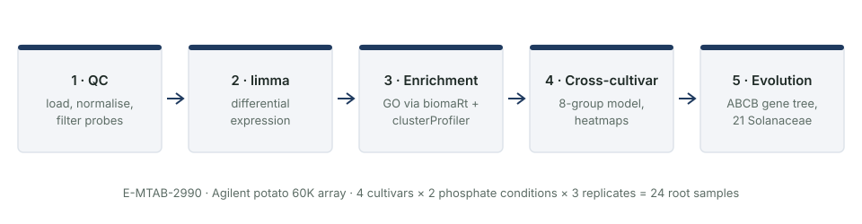
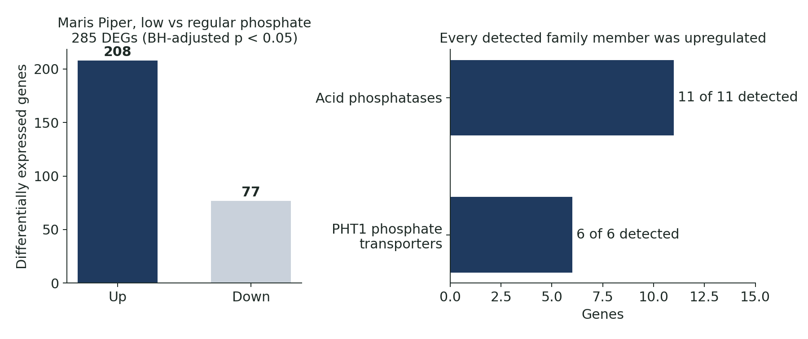
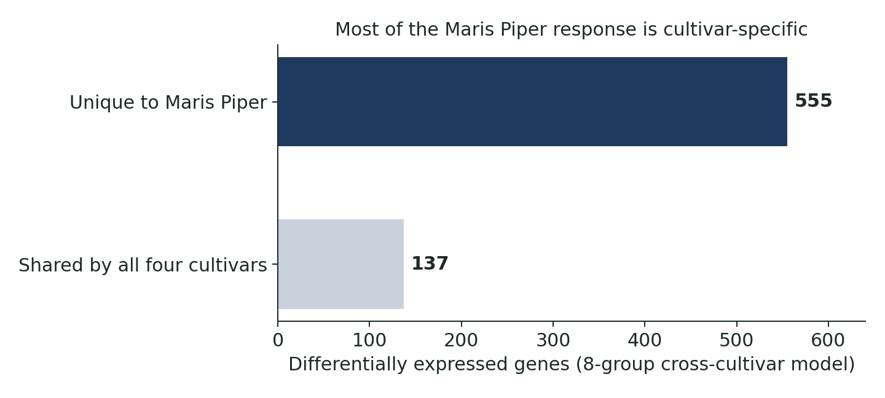

[← All projects](../../projects.qmd){.back-link}

::: {.question-box}
How do potato roots respond to phosphate starvation, and how much of that response is shared across cultivars?
:::

::: {.stats}
::: {.stat}
[285]{.num}
[DEGs in Maris Piper under low phosphate]{.lbl}
:::
::: {.stat}
[73%]{.num}
[of those upregulated]{.lbl}
:::
::: {.stat}
[17 / 17]{.num}
[acid phosphatases and PHT1 transporters upregulated]{.lbl}
:::
::: {.stat}
[555]{.num}
[DEGs unique to Maris Piper (137 shared)]{.lbl}
:::
:::

## The question

Phosphate is essential for plant growth but often limiting in agricultural soils, so understanding
how crops sense and respond to low phosphate matters for breeding more efficient varieties. The
dataset E-MTAB-2990 measured root gene expression in four potato cultivars under different
phosphate levels, but had never been systematically analysed.

## The data

- **Source:** [E-MTAB-2990](https://www.ebi.ac.uk/biostudies/arrayexpress/studies/E-MTAB-2990)
  on ArrayExpress (EBI), deposited by the James Hutton Institute in 2014.
- **Platform:** Agilent one-colour potato 60K array (A-MEXP-2272, 54,317 probes).
- **Design:** four cultivars (Maris Piper, Pentland Dell, Stirling, 12601) × two phosphate
  conditions × three replicates = 24 root samples.

## Methods

{fig-alt="Five stages: QC, limma, enrichment, cross-cultivar, evolution"}

1. **Quality control:** loaded the raw arrays with their sample metadata, normalised, filtered
   probes, and used PCA and inter-array correlation to flag one variable replicate.
2. **Differential expression with limma:** moderated t-tests with Benjamini–Hochberg FDR control
   (adjusted p < 0.05). The analysis was run both with and without the flagged replicate as a
   robustness check.
3. **Functional enrichment:** potato has limited annotation, so GO terms were retrieved from
   Ensembl Plants with **biomaRt** and tested with **clusterProfiler**.
4. **Cross-cultivar comparison:** an eight-group limma model (4 cultivars × 2 conditions),
   heatmaps and Venn diagrams to separate shared from cultivar-specific responses.
5. **Evolutionary analysis:** the top gene was BLASTed against plant RefSeq and a gene tree of
   21 Solanaceae species built with **ape**.

## Results

{fig-alt="Left: 208 genes up, 77 down. Right: 11 of 11 acid phosphatases and 6 of 6 PHT1 transporters upregulated."}

{fig-alt="555 DEGs unique to Maris Piper versus 137 shared by all four cultivars"}

- The top gene, **PGSC0003DMT400069516**, is an ABCB-family auxin efflux transporter
  upregulated about **79-fold**. It is conserved across 21 Solanaceae species, consistent with
  roots remodelling their architecture to forage for phosphate.
- Every acid phosphatase (11) and PHT1 phosphate transporter (6) detected was upregulated.
- 555 DEGs were unique to Maris Piper against 137 shared by all four cultivars, so breeding for
  phosphate efficiency may need to be cultivar-aware.

## Limitations and next steps

- Three replicates per group, and one variable replicate, limit statistical power; conclusions
  were checked with and without that replicate.
- Potato GO annotation is incomplete, so enrichment results are exploratory (nominal p < 0.05).
- Microarrays only measure genes on the chip; RNA-seq would give a fuller picture.

## What I learned

- How to take a public dataset from raw files to biological interpretation in a reproducible,
  stage-by-stage pipeline.
- How to work around poor annotation in a non-model crop.
- Why a sensitivity analysis (with and without the outlier) makes a result more convincing.

## Code

All five R Markdown notebooks are on GitHub. The raw data are public on ArrayExpress.

[View the repository on GitHub](https://github.com/halireena/E-MTAB-2990-Potato-Phosphate-Transcriptomics){.btn-cute .solid}
