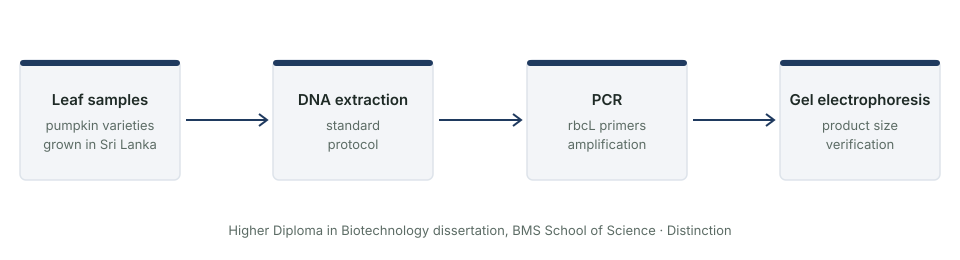

::: {.question-box}
Can the *rbcL* gene region be amplified reliably from local pumpkin varieties, as a first step towards telling them apart?
:::

::: {.badges}
[Distinction]{.badge-cute}
[Wet-lab project]{.badge-cute}
:::

## The question

*rbcL* is a chloroplast gene widely used as a **DNA barcode** for plants. Before you can compare
varieties with it, you need a reliable way to amplify it from each one. My dissertation tested
that for pumpkin varieties grown in Sri Lanka.

## Methods

{fig-alt="Workflow illustration: leaf sample, DNA extraction, PCR of rbcL, gel electrophoresis"}

1. **DNA extraction** from pumpkin leaf samples.
2. **PCR** to amplify the *rbcL* gene region.
3. **Gel electrophoresis** to check the amplified products.

## What I learned

::: {.learned}
- Core molecular biology lab skills that I later used as a lab intern at the Industrial Technology Institute.
- How to troubleshoot a PCR, and why careful documentation matters.
- This project is where I first saw that DNA sequences are data, which led me to bioinformatics.
:::
