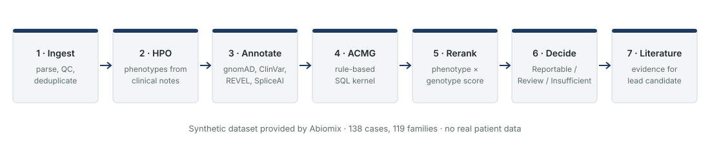
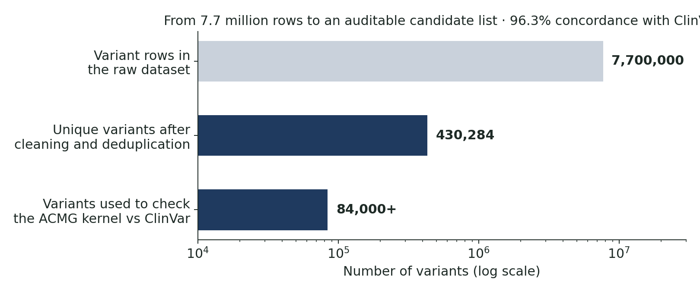
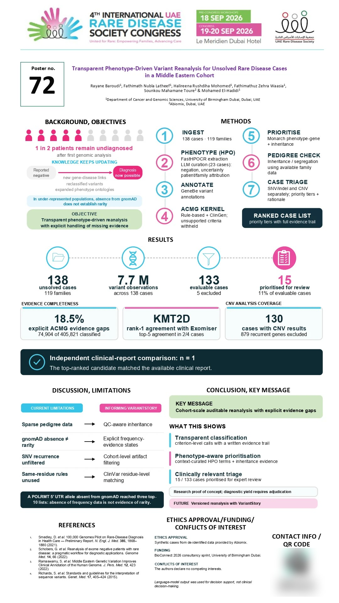
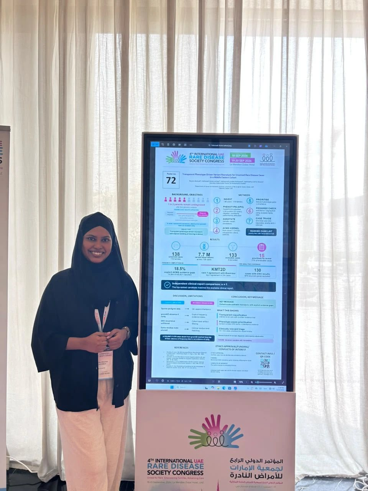

[← All projects](../../projects.qmd){.back-link}

::: {.question-box}
When a laboratory holds hundreds of unsolved rare-disease cases, which ones are most worth re-analysing first?
:::

::: {.badges}
[First place, BioConnect 2026]{.badge-cute}
[Selected for the BioConnect Accelerator]{.badge-cute}
[Poster No. 72, UAE Rare Disease Society Congress 2026]{.badge-cute}
:::

::: {.stats}
::: {.stat}
[138]{.num}
[cases from 119 families processed end to end]{.lbl}
:::
::: {.stat}
[430,284]{.num}
[unique variants, from 7.7 million rows]{.lbl}
:::
::: {.stat}
[96.3%]{.num}
[ACMG-kernel concordance with ClinVar]{.lbl}
:::
::: {.stat}
[4 / 5]{.num}
[probands with top-five gene agreement with Exomiser]{.lbl}
:::
:::

## The question

Around half of rare-disease patients stay undiagnosed after their first genomic analysis, yet new
gene–disease links and better databases mean many of those cases could now be solved. The
bottleneck is expert time. This was the challenge set by Abiomix at the **BioConnect 2026
Consultancy Sprint** (University of Birmingham Dubai, 2–5 July 2026), tackled by a team of three.

## The data

A **synthetic** dataset provided by Abiomix: 138 de-identified cases across 119 families, with
clinical notes and 7.7 million variant rows. No real patient data were used. The cohort is mostly
of Middle-Eastern ancestry, where reference resources such as gnomAD are less complete, and 43
cases involved consanguinity; both were treated as first-class considerations.

## Methods

{fig-alt="Seven stages: ingest, HPO, annotate, ACMG, rerank, decide, literature"}

- **Phenotypes:** HPO terms extracted from clinical notes, with negation and family-history
  filtering so that relatives' symptoms are not attributed to the patient.
- **Classification:** a transparent, rule-based ACMG/AMP kernel written in SQL that records every
  criterion it fires and abstains when evidence is insufficient.
- **Ranking:** candidates scored by phenotype match, then each case assigned a Reportable, Review
  or Insufficient tier with a written rationale.

## Results

{fig-alt="Log-scale bar chart: 7.7 million rows, 430,284 unique variants, 84,000+ variants checked against ClinVar"}

- Independent cross-check against **Exomiser** (sprint version): a direct top-ranked match on
  *KMT2D*, and top-five candidate-gene agreement in four of five phenotyped probands.
- Six probands examined in depth, for example a textbook autosomal-recessive segregation of *CCNO*
  (Reportable), and one case correctly declined because its "phenotype" described relatives.

## After the sprint

- **First place:** our team won the Abiomix challenge.
- **BioConnect Accelerator:** the project was selected for the accelerator programme, with an
  online showcase on 30 July 2026.
- **Congress poster:** *Transparent phenotype-driven variant re-analysis for unsolved rare disease
  cases in a Middle Eastern cohort*, Poster No. 72, 4th International UAE Rare Disease Society
  Congress, Le Méridien Dubai, 19–20 September 2026. I wrote the poster's background section.
- A manuscript is in preparation.

## The congress poster

The work was refined after the sprint and presented as **Poster No. 72** at the 4th International
UAE Rare Disease Society Congress, Le Méridien Dubai, 19–20 September 2026.

[{fig-alt="Congress poster with background, seven-step methods, results, discussion and conclusion sections" width=80%}](poster-72.jpg)

{fig-alt="Halireena standing beside the digital poster screen at the congress" width=55%}

Headline results in the congress version:

::: {.stats}
::: {.stat}
[133]{.num}
[evaluable cases (5 excluded)]{.lbl}
:::
::: {.stat}
[15]{.num}
[cases prioritised for expert review (11%)]{.lbl}
:::
::: {.stat}
[18.5%]{.num}
[of ACMG classifications with explicit evidence gaps]{.lbl}
:::
::: {.stat}
[130]{.num}
[cases with copy-number variant results]{.lbl}
:::
:::

- *KMT2D* ranked first in agreement with Exomiser, with top-five agreement in 2 of 4 cases under
  the stricter congress analysis.
- In an independent comparison with the one available clinical report, the top-ranked candidate
  matched.
- A lesson the poster highlights: a variant missing from gnomAD is not evidence that it is rare,
  especially for under-represented populations.

## My role

This was a team of three. My contributions included looking after the GitHub repository,
validating the pipeline (including the cross-check against Exomiser), the copy-number variant
analysis, and coordinating the team's work.

## Limitations

- Synthetic data: the pipeline is a proof of concept, not a validated clinical tool.
- Any language-model output is treated as decision support only, never as a diagnosis.
- Population frequencies are less reliable for under-represented ancestries.

## What I learned

- How clinical variant interpretation works in practice, from ACMG criteria to segregation.
- Why traceability matters more than raw accuracy when results inform patient care.
- How to deliver a working, documented prototype as a team in four days.

## Code

[View the repository on GitHub](https://github.com/halireena/abiomix-rare-disease-prioritisation){.btn-cute .solid}
