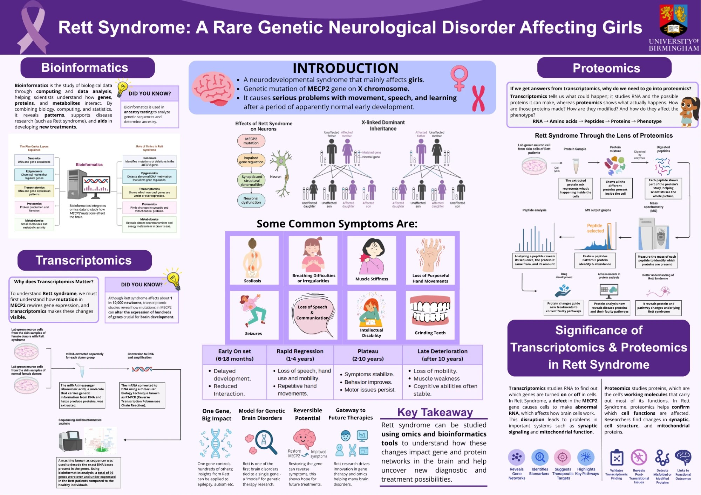

[← All projects](../../projects.qmd){.back-link}

**Scientific Communication module · MSc Bioinformatics, University of Birmingham Dubai**

::: {.question-box}
How can transcriptomics and proteomics help us understand a rare genetic brain disorder, and how do you explain that to someone outside the field?
:::

[{fig-alt="Poster titled Rett Syndrome: A Rare Genetic Neurological Disorder Affecting Girls, with sections on bioinformatics, transcriptomics, proteomics, symptoms and disease stages"}](poster.jpg)

## What the poster covers

- **The disorder:** Rett syndrome is a neurodevelopmental condition, mainly affecting girls,
  caused by mutations in the *MECP2* gene on the X chromosome. It is explained with an X-linked
  dominant inheritance diagram and a pathway from mutation to neuronal dysfunction.
- **Symptoms and stages:** eight common symptoms, and the four clinical stages from early onset
  (6–18 months) to late deterioration (after 10 years).
- **Bioinformatics:** how the five omics layers (genomics, epigenomics, transcriptomics,
  proteomics, metabolomics) each reveal a different part of the disease.
- **Transcriptomics:** the workflow from patient-derived neuron cells, through RNA extraction and
  RT-PCR, to sequencing and differential-expression analysis.
- **Proteomics:** from cell lysis and enzyme digestion to mass spectrometry, and why proteins
  show what actually happens in the cell, not just what could happen.
- **Why it matters:** omics reveals the gene and protein networks behind the symptoms, pointing
  to biomarkers and therapeutic targets.

## Skills shown

::: {.chips}
[Science communication]{.chip} [Visual design]{.chip} [Transcriptomics]{.chip} [Proteomics]{.chip} [Mass spectrometry]{.chip} [Human genetics]{.chip} [Literature review]{.chip}
:::

## What I learned

- How to turn a complex multi-omics topic into a single page a non-specialist can follow.
- Why transcriptomics and proteomics answer different questions: what *could* happen versus what
  *does* happen in a cell.
- Designing figures and workflows so that the visual tells the story before the text does.
